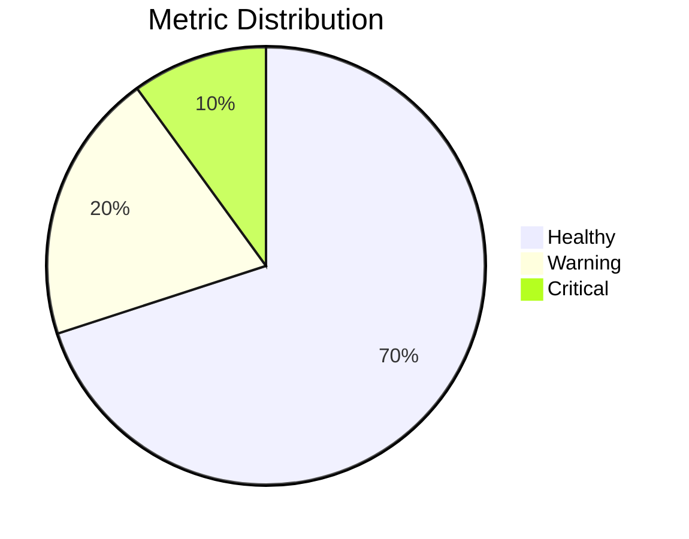
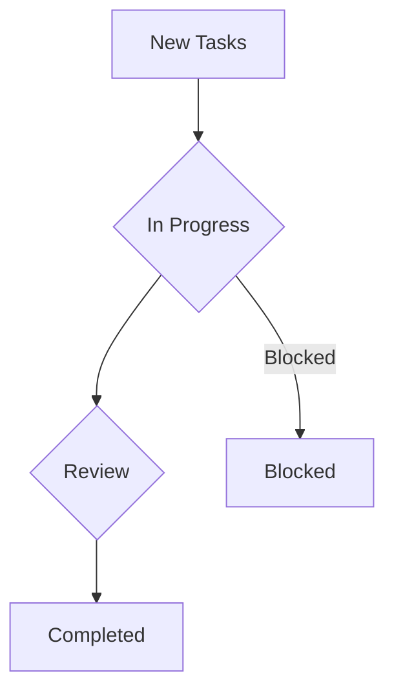

# Dashboard Writer Skill

## Overview

**Skill Name:** `dashboard_writer`
**Domain:** `foundation`
**Purpose:** Generate clear, concise, and structured Markdown-based dashboard summaries for tasks, approvals, and metrics, ensuring key information is easily digestible and actionable.

**Core Capabilities:**
- Generate structured Markdown dashboards from various data sources
- Summarize task status, progress, and blockers
- Present approval requests and their current states
- Display key performance indicators (KPIs) and metrics
- Highlight critical information and trends
- Support customizable layouts and data visualizations (via Mermaid)
- Ensure data consistency and handle missing metrics gracefully

**When to Use:**
- Project status reporting and weekly summaries
- Executive dashboards for quick overview
- Daily stand-up reports for team progress
- Approval process tracking and status updates
- Monitoring key metrics and operational health
- Automating report generation for recurring meetings
- Creating documentation for system health and performance

**When NOT to Use:**
- Real-time interactive dashboards (use dedicated BI tools)
- Highly complex data visualization requiring specialized charting libraries
- Ad-hoc data analysis (use data exploration tools)
- Storing raw data (use databases or data lakes)
- Extremely verbose reports with detailed raw data
- Sensitive data reporting without proper access controls (Markdown is plain text)

---

## Impact Analysis

### Reporting Impact: **CRITICAL**
- **Data Consistency:** Inconsistent or incorrect data leads to flawed decisions.
- **Clarity Risk:** Vague or poorly structured dashboards hinder understanding.
- **Completeness:** Missing critical metrics or approvals can lead to oversights.
- **Timeliness:** Outdated dashboards provide irrelevant information.

### Business Impact: **HIGH**
- **Decision Making:** Accurate dashboards enable informed business decisions.
- **Transparency:** Clear reporting builds trust and alignment across teams.
- **Efficiency:** Automated dashboards reduce manual reporting effort.
- **Risk Management:** Highlighting issues quickly helps mitigate risks.

### System Impact: **MEDIUM**
- **Data Source Integration:** Requires reliable access to various data systems.
- **Performance:** Generating large dashboards must be efficient.
- **Template Maintenance:** Templates need to be robust and easy to update.
- **Security:** Ensure data pulled for dashboards is authorized and secure.

---

## Environment Variables

### Required Variables

```bash
# Dashboard generation configuration
DASHBOARD_TEMPLATE_PATH="./templates/dashboards" # Template directory
DASHBOARD_OUTPUT_PATH="./dashboards"             # Output directory
DASHBOARD_DATA_SOURCE="json"                     # Data source type (e.g., json, yaml, api)

# Content preferences
DASHBOARD_REPORT_DATE_FORMAT="%Y-%m-%d"          # Date format for reports
DASHBOARD_TIMEZONE="UTC"                         # Timezone for date/time sensitive data
```

### Optional Variables

```bash
# Advanced options
DASHBOARD_INCLUDE_TOC="true"                     # Generate table of contents
DASHBOARD_TOC_DEPTH="2"                          # TOC depth (1-6)
DASHBOARD_INCLUDE_MERMAID="true"                 # Include Mermaid diagrams for charts

# Data fetching
DASHBOARD_API_ENDPOINT=""                        # API endpoint for fetching data
DASHBOARD_API_TOKEN=""                           # API token for authentication
DASHBOARD_FALLBACK_DATA_PATH="./fallback_data.json" # Local fallback data if API fails

# Styling and branding
DASHBOARD_LOGO_URL=""                            # URL to company logo
DASHBOARD_THEME="light"                          # 'light' or 'dark' theme (influences Mermaid)

# Validation and quality
DASHBOARD_MIN_SECTIONS="3"                       # Minimum sections required for a dashboard
DASHBOARD_REQUIRE_METRICS="true"                 # Require at least one metrics section
DASHBOARD_FAIL_ON_MISSING_DATA="true"           # If true, fail if required data is missing
```

---

## Network and Authentication Implications

### Local Generation Mode

**Primary Mode:** File-based data and template processing.

**Requirements:**
- Read access to data files (JSON, YAML)
- Read access to template directory
- Write access to output directory
- No network dependencies (offline capable)

### Integrated Mode (Optional)

**For external data source integration:**

```bash
# API Authentication
DASHBOARD_API_AUTH_TYPE="bearer"             # e.g., bearer, basic, api_key
DASHBOARD_API_USERNAME=""                    # For basic auth
DASHBOARD_API_PASSWORD=""                    # For basic auth

# External data sources
DASHBOARD_METRICS_API="https://metrics.example.com/api"
DASHBOARD_TASKS_API="https://tasks.example.com/api"
DASHBOARD_APPROVALS_API="https://approvals.example.com/api"
```

**Authentication Patterns:**
- **Bearer Token:** For API-based authentication (preferred)
- **Basic Auth:** For legacy systems
- **API Key:** For service-to-service communication
- **OAuth 2.0:** For complex delegated access (if API supports)

### Network Patterns

**Pattern 1: Standalone (No Network)**
```bash
# Local data, local templates
# No external data fetches
```

**Pattern 2: Hybrid (Optional Network)**
```bash
# Fetch data from APIs, but use local fallback if network fails
# Graceful degradation for unavailable services
```

**Pattern 3: Fully Integrated (Network Required)**
```bash
# Constant polling or webhooks for data updates
# Critical for real-time or near real-time dashboards
```

---

## Blueprints & Templates

### Template 1: Standard Dashboard Layout

**File:** `assets/dashboard-template.md`

```markdown
---
title: {{DASHBOARD_TITLE}}
date: {{REPORT_DATE}}
author: {{AUTHOR}}
version: 1.0.0
status: generated
---

# {{DASHBOARD_TITLE}}

## Executive Summary

{{EXECUTIVE_SUMMARY}}

---

## Table of Contents

<!-- AUTO-GENERATED TOC -->

---

## Key Metrics

### Overall Health

| Metric Name | Value | Trend | Status |
|-------------|-------|-------|--------|
| {{METRIC_1}} | {{VALUE_1}} | {{TREND_1}} | {{STATUS_1}} |
| {{METRIC_2}} | {{VALUE_2}} | {{TREND_2}} | {{STATUS_2}} |
| {{METRIC_3}} | {{VALUE_3}} | {{TREND_3}} | {{STATUS_3}} |



### Performance Metrics

{{PERFORMANCE_METRICS_TABLE}}

---

## Task Overview

### Open Tasks by Priority

| Priority | Count | Assignee | Due Date |
|----------|-------|----------|----------|
| High     | {{HIGH_TASK_COUNT}} | {{HIGH_TASK_ASSIGNEE}} | {{HIGH_TASK_DUEDATE}} |
| Medium   | {{MEDIUM_TASK_COUNT}} | {{MEDIUM_TASK_ASSIGNEE}} | {{MEDIUM_TASK_DUEDATE}} |
| Low      | {{LOW_TASK_COUNT}} | {{LOW_TASK_ASSIGNEE}} | {{LOW_TASK_DUEDATE}} |



### Recent Activity

- **Task ID:** {{TASK_ID_1}} - **Description:** {{TASK_DESC_1}} - **Status:** {{TASK_STATUS_1}}
- **Task ID:** {{TASK_ID_2}} - **Description:** {{TASK_DESC_2}} - **Status:** {{TASK_STATUS_2}}
- **Task ID:** {{TASK_ID_3}} - **Description:** {{TASK_DESC_3}} - **Status:** {{TASK_STATUS_3}}

---

## Approval Requests

### Pending Approvals

| Request ID | Type | Initiator | Status | Due Date |
|------------|------|-----------|--------|----------|
| {{APPROVAL_ID_1}} | {{APPROVAL_TYPE_1}} | {{APPROVAL_INIT_1}} | {{APPROVAL_STATUS_1}} | {{APPROVAL_DUEDATE_1}} |
| {{APPROVAL_ID_2}} | {{APPROVAL_TYPE_2}} | {{APPROVAL_INIT_2}} | {{APPROVAL_STATUS_2}} | {{APPROVAL_DUEDATE_2}} |

### Recently Approved

- **Request ID:** {{APPROVED_ID_1}} - **Type:** {{APPROVED_TYPE_1}} - **Approved By:** {{APPROVED_BY_1}}
- **Request ID:** {{APPROVED_ID_2}} - **Type:** {{APPROVED_TYPE_2}} - **Approved By:** {{APPROVED_BY_2}}

---

## Action Items & Recommendations

- **Action 1:** {{ACTION_ITEM_1}}
- **Action 2:** {{ACTION_ITEM_2}}
- **Recommendation 1:** {{RECOMMENDATION_1}}

---

## Footer

**Generated By:** Dashboard Writer Skill
**Source Data Last Updated:** {{DATA_LAST_UPDATED}}
```

### Template 2: Python Dashboard Generator

**File:** `assets/dashboard_generator.py`

```python
#!/usr/bin/env python3
"""
dashboard_generator.py
Generates Markdown dashboard summaries from data.
"""

import os
import json
import yaml
from datetime import datetime
from typing import Dict, Any, Optional, List
from pathlib import Path
import logging

logging.basicConfig(level=logging.INFO, format='%(asctime)s - %(levelname)s - %(message)s')
logger = logging.getLogger(__name__)

class DashboardGenerator:
    """Generates Markdown dashboard summaries."""

    def __init__(self,
                 template_path: Optional[Path] = None,
                 output_path: Optional[Path] = None,
                 data_source_type: str = "json"):

        self.template_path = template_path or Path(os.getenv('DASHBOARD_TEMPLATE_PATH', './templates/dashboards'))
        self.output_path = output_path or Path(os.getenv('DASHBOARD_OUTPUT_PATH', './dashboards'))
        self.data_source_type = data_source_type.lower()

        self.output_path.mkdir(parents=True, exist_ok=True)

        self.report_date_format = os.getenv('DASHBOARD_REPORT_DATE_FORMAT', '%Y-%m-%d')
        self.timezone = os.getenv('DASHBOARD_TIMEZONE', 'UTC') # Not fully implemented, for documentation
        self.include_toc = os.getenv('DASHBOARD_INCLUDE_TOC', 'true').lower() == 'true'
        self.include_mermaid = os.getenv('DASHBOARD_INCLUDE_MERMAID', 'true').lower() == 'true'

        logger.info("DashboardGenerator initialized.")

    def _load_template(self, template_name: str = "dashboard-template.md") -> str:
        """Loads a Markdown template file."""
        template_file = self.template_path / template_name
        if not template_file.exists():
            logger.error(f"Template file not found: {template_file}")
            raise FileNotFoundError(f"Template file not found: {template_file}")
        with open(template_file, 'r') as f:
            return f.read()

    def _load_data(self, data_file: Path) -> Dict[str, Any]:
        """Loads data from a JSON or YAML file."""
        if not data_file.exists():
            logger.warning(f"Data file not found: {data_file}")
            if os.getenv('DASHBOARD_FAIL_ON_MISSING_DATA', 'true').lower() == 'true':
                raise FileNotFoundError(f"Required data file not found: {data_file}")
            return {}

        try:
            if data_file.suffix == '.json':
                with open(data_file, 'r') as f:
                    return json.load(f)
            elif data_file.suffix in ('.yaml', '.yml'):
                with open(data_file, 'r') as f:
                    return yaml.safe_load(f)
            else:
                logger.error(f"Unsupported data file type: {data_file.suffix}")
                raise ValueError(f"Unsupported data file type: {data_file.suffix}")
        except Exception as e:
            logger.error(f"Error loading data from {data_file}: {e}")
            if os.getenv('DASHBOARD_FAIL_ON_MISSING_DATA', 'true').lower() == 'true':
                raise
            return {}

    def _populate_template(self, template_content: str, data: Dict[str, Any]) -> str:
        """Populates the Markdown template with data."""
        # Common placeholders
        data['REPORT_DATE'] = datetime.now().strftime(self.report_date_format)
        data['AUTHOR'] = os.getenv('USER', 'Gemini CLI') # Default author

        # Simple string replacement for now
        # For more complex templating, consider Jinja2
        populated_content = template_content
        for key, value in data.items():
            placeholder = '{{' + key.upper() + '}}'
            if isinstance(value, (str, int, float)):
                populated_content = populated_content.replace(placeholder, str(value))
            elif isinstance(value, list) and key.upper() == 'PERFORMANCE_METRICS_TABLE':
                # Custom handling for table generation
                table_rows = []
                for metric in value:
                    table_rows.append(f"| {metric.get('name', '')} | {metric.get('value', '')} | {metric.get('trend', '')} | {metric.get('status', '')} |")
                populated_content = populated_content.replace(placeholder, "
".join(table_rows))
            # Handle other list/dict data more gracefully if needed, e.g., looping for task lists

        # Remove any remaining {{PLACEHOLDER}} that weren't populated
        populated_content = re.sub(r'\{\{.*?\}\}', 'N/A', populated_content)

        return populated_content

    def generate_dashboard(self, data_file: Path, output_filename: Optional[str] = None) -> Path:
        """Generates a dashboard Markdown file."""
        logger.info(f"Generating dashboard for data file: {data_file}")

        try:
            template_content = self._load_template()
            data = self._load_data(data_file)
            
            # Validate essential data
            self._validate_data(data)

            populated_markdown = self._populate_template(template_content, data)

            # Post-processing for TOC and Mermaid if enabled (simple approach)
            if self.include_toc:
                populated_markdown = self._add_table_of_contents(populated_markdown)
            if not self.include_mermaid:
                # Remove mermaid blocks if not enabled
                populated_markdown = re.sub(r'```mermaid.*?```', '', populated_markdown, flags=re.DOTALL)

            output_filename = output_filename or f"dashboard-{datetime.now().strftime('%Y%m%d%H%M%S')}.md"
            output_file = self.output_path / output_filename

            with open(output_file, 'w') as f:
                f.write(populated_markdown)

            logger.info(f"Dashboard successfully generated: {output_file}")
            return output_file

        except Exception as e:
            logger.error(f"Failed to generate dashboard: {e}")
            raise

    def _add_table_of_contents(self, markdown_content: str) -> str:
        """Adds a simple Table of Contents to the Markdown content."""
        lines = markdown_content.split('
')
        toc_lines = []
        in_code_block = False
        
        for line in lines:
            if line.strip().startswith('```'):
                in_code_block = not in_code_block
            
            if not in_code_block and (line.startswith('## ') or line.startswith('### ')):
                level = line.count('#')
                title = line.lstrip('# ').strip()
                slug = title.lower().replace(' ', '-').replace('.', '').replace('/', '') # Simple slugify
                toc_lines.append(f"{'  ' * (level - 2)}- [{title}](#{slug})") # Only for ## and ###

        toc_section_index = -1
        try:
            toc_section_index = lines.index("<!-- AUTO-GENERATED TOC -->")
        except ValueError:
            return markdown_content # No TOC placeholder found

        # Insert TOC
        new_lines = lines[:toc_section_index] + toc_lines + [''] + lines[toc_section_index+1:]
        return '
'.join(new_lines)

    def _validate_data(self, data: Dict[str, Any]):
        """Validates essential data for dashboard generation."""
        if os.getenv('DASHBOARD_FAIL_ON_MISSING_DATA', 'true').lower() == 'true':
            if not data.get('DASHBOARD_TITLE'):
                raise ValueError("Missing required data: DASHBOARD_TITLE")
            if not data.get('EXECUTIVE_SUMMARY'):
                raise ValueError("Missing required data: EXECUTIVE_SUMMARY")
            if os.getenv('DASHBOARD_REQUIRE_METRICS', 'true').lower() == 'true' and not data.get('METRICS'):
                # This check is basic, actual template population expects individual metrics
                logger.warning("No 'METRICS' section found in data, but DASHBOARD_REQUIRE_METRICS is true.")

        min_sections = int(os.getenv('DASHBOARD_MIN_SECTIONS', '3'))
        # This is a very rough check, ideally we'd check parsed markdown sections
        # For now, just ensure top-level data elements are present
        if len(data.keys()) < min_sections:
             logger.warning(f"Data object has fewer than {min_sections} top-level keys, consider adding more sections.")

# Example usage
if __name__ == "__main__":
    # Setup environment variables for demonstration
    os.environ['DASHBOARD_TEMPLATE_PATH'] = './assets'
    os.environ['DASHBOARD_OUTPUT_PATH'] = './output'
    os.environ['DASHBOARD_FAIL_ON_MISSING_DATA'] = 'false' # Allow generation even if data is incomplete

    generator = DashboardGenerator()

    # Create a dummy data file for demonstration
    dummy_data = {
        "DASHBOARD_TITLE": "Weekly Project Status",
        "EXECUTIVE_SUMMARY": "Project Alpha is progressing well. Key milestones achieved include module X completion. Minor delays in module Y due to external dependency. Overall health is good.",
        "METRIC_1": "Backend Latency", "VALUE_1": "150ms", "TREND_1": "Stable", "STATUS_1": "Green",
        "METRIC_2": "Error Rate", "VALUE_2": "0.01%", "TREND_2": "Decreasing", "STATUS_2": "Green",
        "METRIC_3": "Uptime", "VALUE_3": "99.98%", "TREND_3": "Stable", "STATUS_3": "Green",
        "PERFORMANCE_METRICS_TABLE": [
            {"name": "API Response Time (P95)", "value": "250ms", "trend": "Stable", "status": "Green"},
            {"name": "Database CPU Usage", "value": "45%", "trend": "Stable", "status": "Green"},
            {"name": "Queue Depth", "value": "100 messages", "trend": "Stable", "status": "Green"}
        ],
        "HIGH_TASK_COUNT": "2", "HIGH_TASK_ASSIGNEE": "Alice", "HIGH_TASK_DUEDATE": "2026-02-10",
        "MEDIUM_TASK_COUNT": "5", "MEDIUM_TASK_ASSIGNEE": "Bob", "MEDIUM_TASK_DUEDATE": "2026-02-15",
        "LOW_TASK_COUNT": "8", "LOW_TASK_ASSIGNEE": "Charlie", "LOW_TASK_DUEDATE": "2026-02-20",
        "TASK_ID_1": "TASK-001", "TASK_DESC_1": "Fix critical bug in payment module", "TASK_STATUS_1": "In Progress",
        "TASK_ID_2": "TASK-002", "TASK_DESC_2": "Implement new user authentication flow", "TASK_STATUS_2": "Review",
        "TASK_ID_3": "TASK-003", "TASK_DESC_3": "Update documentation for API v2", "TASK_STATUS_3": "Completed",
        "APPROVAL_ID_1": "APP-001", "APPROVAL_TYPE_1": "Feature Deployment", "APPROVAL_INIT_1": "Dev Team", "APPROVAL_STATUS_1": "Pending", "APPROVAL_DUEDATE_1": "2026-02-08",
        "APPROVAL_ID_2": "APP-002", "APPROVAL_TYPE_2": "Budget Request", "APPROVAL_INIT_2": "Finance", "APPROVAL_STATUS_2": "Pending", "APPROVAL_DUEDATE_2": "2026-02-12",
        "APPROVED_ID_1": "APP-003", "APPROVED_TYPE_1": "Marketing Campaign", "APPROVED_BY_1": "VP Marketing",
        "APPROVED_ID_2": "APP-004", "APPROVED_TYPE_2": "Hiring Request", "APPROVED_BY_2": "HR Lead",
        "ACTION_ITEM_1": "Follow up on Module Y dependency with external vendor.",
        "ACTION_ITEM_2": "Prioritize critical bug fixes for next sprint.",
        "RECOMMENDATION_1": "Allocate additional resources to Module Y to mitigate delays."
    }
    
    # Create the output directory for the example if it doesn't exist
    Path('./output').mkdir(parents=True, exist_ok=True)
    dummy_data_file = Path('./output/example-dashboard-data.json')
    with open(dummy_data_file, 'w') as f:
        json.dump(dummy_data, f, indent=2)

    # Generate dashboard
    output_file = generator.generate_dashboard(dummy_data_file, "weekly-report.md")
    print(f"
Generated dashboard example: {output_file}")
```

### Template 3: Example Data for Dashboard

**File:** `assets/example-dashboard-data.json`

```json
{
  "DASHBOARD_TITLE": "Q1 2026 Engineering Dashboard",
  "EXECUTIVE_SUMMARY": "Q1 2026 saw significant progress in key initiatives. Project Gemini is on track, with 80% of features completed. Production incident rate remains stable. Focus for Q2 will be on reducing technical debt and improving CI/CD pipeline efficiency.",
  "METRIC_1": "Production Incidents",
  "VALUE_1": "5",
  "TREND_1": "Stable",
  "STATUS_1": "Yellow",
  "METRIC_2": "Deployment Frequency",
  "VALUE_2": "12/week",
  "TREND_2": "Increasing",
  "STATUS_2": "Green",
  "METRIC_3": "Open Bugs (Critical)",
  "VALUE_3": "3",
  "TREND_3": "Stable",
  "STATUS_3": "Red",
  "PERFORMANCE_METRICS_TABLE": [
    {
      "name": "API Latency (P99)",
      "value": "350ms",
      "trend": "Stable",
      "status": "Yellow"
    },
    {
      "name": "Service Uptime (Overall)",
      "value": "99.95%",
      "trend": "Stable",
      "status": "Green"
    },
    {
      "name": "Test Automation Coverage",
      "value": "75%",
      "trend": "Increasing",
      "status": "Green"
    },
    {
      "name": "Cloud Spend (Monthly)",
      "value": "$50,000",
      "trend": "Stable",
      "status": "Green"
    }
  ],
  "HIGH_TASK_COUNT": "7",
  "HIGH_TASK_ASSIGNEE": "Various",
  "HIGH_TASK_DUEDATE": "Next 7 Days",
  "MEDIUM_TASK_COUNT": "15",
  "MEDIUM_TASK_ASSIGNEE": "Various",
  "MEDIUM_TASK_DUEDATE": "Next 30 Days",
  "LOW_TASK_COUNT": "25",
  "LOW_TASK_ASSIGNEE": "Various",
  "LOW_TASK_DUEDATE": "Next 90 Days",
  "TASK_ID_1": "PROD-101",
  "TASK_DESC_1": "Investigate database deadlocks",
  "TASK_STATUS_1": "Blocked",
  "TASK_ID_2": "FEAT-205",
  "TASK_DESC_2": "Develop new user profile page",
  "TASK_STATUS_2": "In Progress",
  "TASK_ID_3": "DEVOPS-310",
  "TASK_DESC_3": "Upgrade CI/CD agents",
  "TASK_STATUS_3": "Pending Review",
  "APPROVAL_ID_1": "REQ-001",
  "APPROVAL_TYPE_1": "New Software License",
  "APPROVAL_INIT_1": "IT Operations",
  "APPROVAL_STATUS_1": "Pending Legal Review",
  "APPROVAL_DUEDATE_1": "2026-02-15",
  "APPROVAL_ID_2": "REQ-002",
  "APPROVAL_TYPE_2": "Project Budget Increase",
  "APPROVAL_INIT_2": "Project Alpha Lead",
  "APPROVAL_STATUS_2": "Pending Finance Approval",
  "APPROVAL_DUEDATE_2": "2026-02-20",
  "APPROVED_ID_1": "REQ-003",
  "APPROVED_TYPE_1": "Server Procurement",
  "APPROVED_BY_1": "Head of Engineering",
  "APPROVED_ID_2": "REQ-004",
  "APPROVED_TYPE_2": "Feature X Release",
  "APPROVED_BY_2": "Product Manager",
  "ACTION_ITEM_1": "Conduct root cause analysis for recent production incidents.",
  "ACTION_ITEM_2": "Review and update Q2 OKRs with team leads.",
  "RECOMMENDATION_1": "Implement automated dependency scanning in CI/CD pipeline.",
  "DATA_LAST_UPDATED": "2026-02-06 17:30:00 UTC"
}
```

### Template 4: MANIFEST.md for Dashboard Writer

**File:** `assets/MANIFEST.md`

```markdown
# Dashboard Writer Skill Manifest

This document outlines the components, structure, and usage of the `dashboard_writer` skill.

## Skill Details

*   **Skill Name:** `dashboard_writer`
*   **Domain:** `foundation`
*   **Purpose:** Generate Markdown-based dashboard summaries for various reporting needs.
*   **Version:** 1.0.0

## Directory Structure

```
.
├── README.md                 # Quick start guide and overview
├── SKILL.md                  # Comprehensive skill specification
├── assets/                   # Templates and core logic
│   ├── dashboard-template.md # Main Markdown dashboard template
│   ├── dashboard_generator.py # Python script for dashboard generation
│   ├── example-dashboard-data.json # Example data for dashboard generation
│   └── MANIFEST.md           # This manifest file
└── docs/                     # Supporting documentation
    ├── gotchas.md            # Common pitfalls and troubleshooting
    ├── impact-checklist.md   # Impact assessment guide
    └── patterns.md           # Dashboard generation patterns and best practices
```

## Core Components

### `dashboard_generator.py`

*   **Description:** A Python script responsible for taking structured data (JSON/YAML) and populating a Markdown template (`dashboard-template.md`) to produce the final dashboard summary.
*   **Functionality:**
    *   Loads templates and data files.
    *   Performs simple string replacement for placeholders.
    *   Includes basic data validation.
    *   Can optionally generate a Table of Contents.
    *   Can optionally remove Mermaid diagrams if disabled.
*   **Usage:** `python dashboard_generator.py <data_file.json> [output_filename.md]`

### `dashboard-template.md`

*   **Description:** The primary Markdown template that defines the structure and layout of the generated dashboards. It contains placeholders (e.g., `{{DASHBOARD_TITLE}}`) that are replaced by data from the `dashboard_generator.py` script.
*   **Sections:** Includes sections for Executive Summary, Key Metrics, Task Overview, Approval Requests, Action Items, and Recommendations.
*   **Visualizations:** Integrates Mermaid syntax for basic diagrams (e.g., pie charts, flowcharts).

### `example-dashboard-data.json`

*   **Description:** A sample JSON file demonstrating the expected data structure for generating a dashboard. It includes example values for all common placeholders used in `dashboard-template.md`.
*   **Purpose:** Serves as a reference for users to understand how to structure their input data and for testing the `dashboard_generator.py` script.

## Documentation

*   **`SKILL.md`:** Detailed specification covering overview, impact analysis, environment variables, network implications, blueprints, validation checklist, and anti-patterns.
*   **`README.md`:** A concise overview of the skill, quick start instructions, and key features.
*   **`docs/patterns.md`:** Explores different patterns and strategies for effective dashboard generation, including data aggregation, visualization choices, and reporting cycles.
*   **`docs/impact-checklist.md`:** A checklist to assess the impact of dashboard reporting on various aspects (e.g., business, operational, technical).
*   **`docs/gotchas.md`:** Highlights common issues, anti-patterns, and troubleshooting tips related to generating and using Markdown dashboards.

## Environment Variables

Refer to `SKILL.md` for a comprehensive list of required and optional environment variables that configure the behavior of the `dashboard_writer` skill, including template paths, output paths, data sources, and formatting preferences.

## Anti-Patterns

Refer to `SKILL.md` and `docs/gotchas.md` for detailed descriptions of anti-patterns to avoid when creating and using dashboards, such as hardcoding data, ignoring errors, and unclear reporting.

## Validation

The skill includes internal validation checks within `dashboard_generator.py` to ensure data completeness and structure. A comprehensive `Validation Checklist` is provided in `SKILL.md` to guide users in assessing the quality and accuracy of generated dashboards.

---
**Last Updated:** 2026-02-06
**Maintained by:** Foundation Team
```
