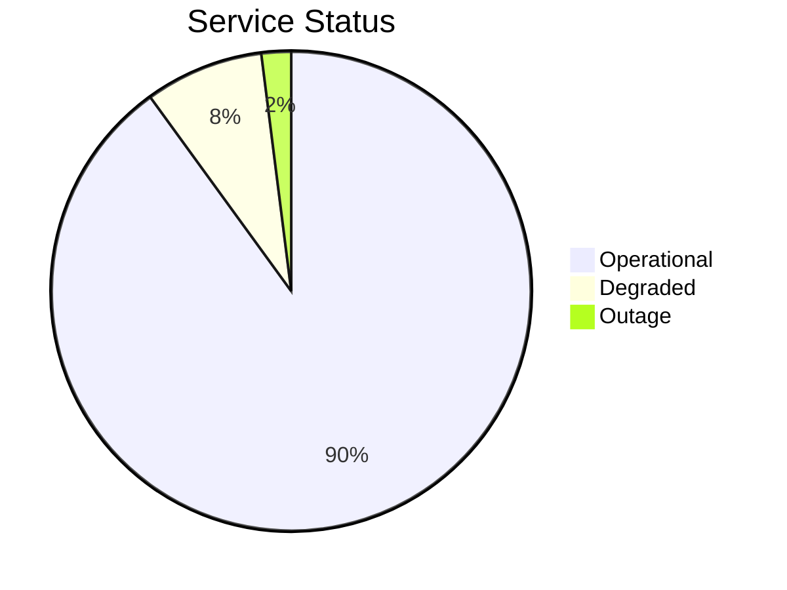

# Dashboard Writer - Common Patterns

## Overview
This document describes common patterns, strategies, and best practices for generating effective Markdown dashboards.

---

## Pattern 1: Metrics-Driven Dashboard

### Use Case
For monitoring system health, service performance, or key business indicators. Focuses on quantifiable data and trends.

### Strategy
1.  **Define KPIs:** Identify 3-7 critical KPIs relevant to the dashboard's purpose (e.g., uptime, error rate, latency, sales conversion).
2.  **Data Sources:** Connect to monitoring systems, analytics platforms, or data warehouses to retrieve raw metric data.
3.  **Aggregation:** Aggregate raw data into digestible summaries (e.g., averages, sums, p95/p99 percentiles) for the reporting period.
4.  **Trend Analysis:** Calculate and display trends (e.g., day-over-day, week-over-week changes) to show performance evolution.
5.  **Status Indication:** Use simple status indicators (Green/Yellow/Red, emojis) based on predefined thresholds.
6.  **Visualizations:** Employ Mermaid charts (pie charts for distribution, flowcharts for processes) for visual representation of key metrics.

### Example Structure
```markdown
# Daily System Health Dashboard

## Key Metrics
| Metric | Value | Trend | Status |
|--------|-------|-------|--------|
| API Latency | 150ms | Stable | Green |
| Error Rate | 0.01% | ↓ | Green |
| Disk Usage | 70% | ↑ | Yellow |


```

---

## Pattern 2: Task & Project Status Dashboard

### Use Case
For project managers, team leads, or stakeholders to quickly understand project progress, outstanding work, and blockers.

### Strategy
1.  **Categorize Tasks:** Group tasks by project, priority (High, Medium, Low), status (New, In Progress, Blocked, Review, Completed), or assignee.
2.  **Highlight Criticals:** Emphasize high-priority tasks, approaching deadlines, and identified blockers.
3.  **Progress Tracking:** Include counts of tasks in each status, and optionally a percentage completion.
4.  **Recent Activity:** List recent task updates or newly created tasks to show dynamic progress.
5.  **Dependencies:** Briefly mention any critical cross-team dependencies.

### Example Structure
```markdown
# Project Alpha - Weekly Status

## Executive Summary
Project Alpha is 70% complete. Module X is deployed, Module Y is in testing, but blocked by an external dependency.

## Task Overview
### Open Tasks by Priority
| Priority | Count | Due This Week | Blocked |
|----------|-------|---------------|---------|
| High     | 5     | 3             | 1       |
| Medium   | 12    | 5             | 0       |
| Low      | 8     | 1             | 0       |

### Critical Blockers
- **TASK-123:** Waiting for external API credentials (ETA: Feb 15)

### Recent Activity
- **TASK-456:** User authentication refactor (In Progress - Alice)
- **TASK-457:** Database migration script reviewed (Completed - Bob)
```

---

## Pattern 3: Approval Workflow Dashboard

### Use Case
To track the status of various approval requests (e.g., deployment approvals, budget requests, design sign-offs).

### Strategy
1.  **Request Categorization:** Group approvals by type (e.g., deployment, finance, legal) or urgency.
2.  **Status Tracking:** Clearly show pending, approved, rejected, or in-review statuses.
3.  **Approval Chain:** Indicate who initiated the request, who is the current approver, and any associated deadlines.
4.  **Audit Trail:** Provide links to the full approval request and a brief summary of recent actions.

### Example Structure
```markdown
# Approvals Dashboard

## Pending Approvals
| Request ID | Type             | Initiator    | Current Approver | Status              | Due Date   |
|------------|------------------|--------------|------------------|---------------------|------------|
| DEP-001    | Production Deploy | Dev Team     | Security Review  | Pending             | 2026-02-10 |
| BUDGET-005 | Q2 Budget        | Finance Team | VP Operations    | Pending             | 2026-02-15 |

## Recently Approved
- **DEP-002:** Staging Deploy - Approved by John Doe (2026-02-05)
- **DESIGN-003:** UI Mockups v2 - Approved by Product Lead (2026-02-04)
```

---

## Pattern 4: Hybrid Dashboard

### Use Case
Combines elements from metrics, tasks, and approvals to provide a holistic view for a specific team or project.

### Strategy
Integrate relevant sections from the above patterns, ensuring a logical flow and avoiding information overload. Prioritize information based on the audience's needs.

### Example Structure
```markdown
# Team X - Weekly Engineering Summary

## Executive Summary
Module A is stable, Module B release is imminent. Minor technical debt cleanup ongoing.

## Key Metrics
| Metric          | Value | Status |
|-----------------|-------|--------|
| Service Uptime  | 99.9% | Green  |
| Code Coverage   | 85%   | Green  |

## Open Tasks (High Priority)
- **TASK-001:** Fix critical bug (Due: Tomorrow)
- **TASK-002:** Review Module B PR (Due: End of Week)

## Pending Approvals
- **DEP-003:** Module B Production Deploy (Pending Security)

## Action Items
- Follow up on security review for DEP-003.
```

---

## Best Practices for Dashboard Generation

1.  **Know Your Audience:** Tailor the content and level of detail to the recipient (e.g., executive vs. engineering team).
2.  **Focus on Actionability:** Every piece of information should ideally lead to understanding or an action.
3.  **Keep it Concise:** Avoid information overload. Summarize, link to details if necessary.
4.  **Consistency:** Maintain consistent formatting, terminology, and metric definitions across reports.
5.  **Timeliness:** Ensure data is fresh and reflects the current state.
6.  **Visual Aids:** Use Mermaid diagrams or simple tables effectively to convey information quickly.
7.  **Audit Trail:** Always include information on when and how the dashboard was generated, and from what data source.
8.  **Graceful Degradation:** Design templates to handle missing or incomplete data without breaking the report.
9.  **Versioning:** Keep generated dashboards under version control if they represent historical snapshots.
10. **Feedback Loop:** Continuously gather feedback on dashboard utility and improve templates/data sources.

---

**Last Updated:** 2026-02-06
