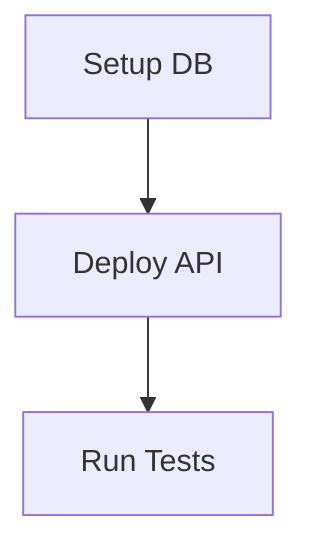

# Plan MD Generator Skill

**Domain:** `foundation`
**Version:** 1.0.0
**Status:** Production Ready

## Quick Start

Generate clear, structured, step-by-step implementation plans in Markdown format with proper dependencies and acceptance criteria.

### Prerequisites

```bash
export PLAN_TEMPLATE_PATH="./templates/plans"
export PLAN_OUTPUT_PATH="./plans"
export PLAN_VALIDATE_LINKS="true"
```

### Basic Usage

**Python:**
```python
from plan_generator import PlanGenerator, Plan, Phase, Step

generator = PlanGenerator()

# Create plan
plan = Plan(
    title="Implement User Authentication",
    objective="Build secure OAuth2 authentication",
    scope="Backend API and database",
    timeline="3 weeks",
    owner="Backend Team",
    author="John Doe",
    problem="Current system lacks proper auth",
    goals=["Implement OAuth2", "Support multiple providers"],
    non_goals=["Frontend UI", "Mobile apps"]
)

# Add phases and steps
phase1 = Phase(id="1", name="Database Setup", duration="1 week")
step1 = Step(
    id="1.1",
    name="Design user schema",
    objective="Create database schema",
    actions=["Define tables", "Add indexes", "Create migrations"],
    acceptance_criteria=["Schema reviewed", "Migration tested"]
)
phase1.steps.append(step1)
plan.phases.append(phase1)

# Generate and save
generator.save_plan(plan, "auth-implementation.md")
```

## Documentation

- **[SKILL.md](./SKILL.md)** - Complete specification (1,100+ lines)
- **[docs/patterns.md](./docs/patterns.md)** - 5 plan generation patterns
- **[docs/impact-checklist.md](./docs/impact-checklist.md)** - Quality assessment
- **[docs/gotchas.md](./docs/gotchas.md)** - Common pitfalls

## Key Features

✅ **Structured Format**
- YAML front matter metadata
- Hierarchical phases and steps
- Mermaid dependency graphs
- Automatic table of contents

✅ **Quality Enforcement**
- Acceptance criteria required
- Link validation
- Dependency checking
- Markdown linting

✅ **Comprehensive Steps**
- Clear objectives
- Specific actions with commands
- Test cases included
- Rollback procedures

✅ **Progress Tracking**
- Checkboxes for completion
- Effort estimates
- Owner assignments
- Timeline milestones

## Plan Types Supported

1. **Technical Implementation** - Software development plans
2. **Sprint Planning** - Agile sprint documentation
3. **Migration Plans** - Database/system migrations
4. **API Development** - API endpoint specifications
5. **Deployment Runbooks** - Step-by-step deployment guides
6. **Onboarding Guides** - New team member onboarding

## Anti-Patterns to Avoid

❌ Vague instructions ("configure the system")
❌ Missing acceptance criteria
❌ Circular dependencies
❌ Broken reference links
❌ No rollback procedures

See [SKILL.md](./SKILL.md#anti-patterns) for detailed examples.

## Example Plan Structure

```markdown
---
title: Implement Feature X
type: technical-implementation
status: draft
---

# Implement Feature X

## Executive Summary
**Objective:** Build feature X
**Timeline:** 2 weeks

## Implementation Plan

### Phase 1: Setup
#### Step 1.1: Configure Environment
**Actions:**
1. Install dependencies: `pip install -r requirements.txt`
2. Set up database: `createdb feature_x`

**Acceptance Criteria:**
- [ ] Dependencies installed
- [ ] Database created

**Testing:**
```bash
pytest tests/
```

**Rollback:** Drop database and uninstall packages
```

## Validation

Plans are automatically validated for:
- Minimum number of steps (default: 3)
- Presence of acceptance criteria
- Valid dependency references
- Broken links (if enabled)
- Proper Markdown syntax

## Integration

### GitHub Issues
Link to issue tracker:
```markdown
**Related Issues:**
- [Feature Request #123](https://github.com/org/repo/issues/123)
- [Bug Fix #456](https://github.com/org/repo/issues/456)
```

### Mermaid Diagrams
Generate dependency graphs:
```markdown

```

## Best Practices

1. **Be Specific** - Include exact commands
2. **Test First** - Verify all commands work
3. **Add Context** - Link to docs and examples
4. **Define Success** - Clear acceptance criteria
5. **Plan Recovery** - Always include rollback
6. **Estimate Time** - Provide effort estimates
7. **Assign Owners** - Clear responsibility
8. **Track Progress** - Use checkboxes
9. **Update Regularly** - Keep plans current
10. **Learn from Feedback** - Iterate and improve

## Requirements

- **Python 3.7+**
- **Markdown viewer/editor**
- **Optional:** Link validator, Markdown linter

## Support

For issues or questions:
1. Check [gotchas.md](./docs/gotchas.md)
2. Review [patterns.md](./docs/patterns.md)
3. Complete [impact-checklist.md](./docs/impact-checklist.md)
4. Consult [SKILL.md](./SKILL.md)

---

**Maintained by:** Foundation Team
**Last Updated:** 2026-02-06
**License:** Internal Use Only
