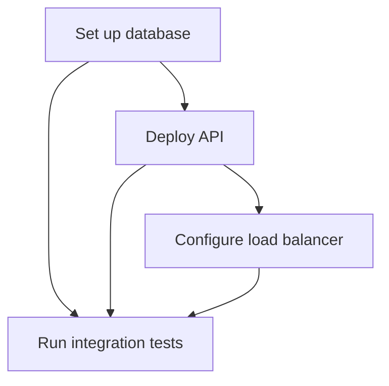

# Plan MD Generator Skill

## Overview

**Skill Name:** `plan_md_generator`
**Domain:** `foundation`
**Purpose:** Generate clear, structured, step-by-step implementation plans in Markdown format with proper dependencies, milestones, and references to ensure executable and maintainable project documentation.

**Core Capabilities:**
- Generate structured Markdown plans from requirements
- Break down complex tasks into executable steps
- Identify and document dependencies between steps
- Create milestone markers for tracking progress
- Validate references and links in generated plans
- Support multiple plan formats (technical, project, sprint)
- Include acceptance criteria and test cases
- Generate visual representations (Mermaid diagrams)

**When to Use:**
- Software development planning and architecture documentation
- Project kickoff and implementation roadmaps
- Sprint planning and task breakdown
- Technical design documentation
- Migration and deployment planning
- Onboarding guides and tutorials
- Process documentation and runbooks

**When NOT to Use:**
- Real-time collaborative editing (use dedicated tools)
- Binary or non-text documentation
- Extremely simple single-step tasks
- Ad-hoc notes without structure requirements
- Live presentations (use slideware)

---

## Impact Analysis

### Documentation Impact: **CRITICAL**
- **Clarity Risk:** Ambiguous steps lead to implementation errors
- **Completeness:** Missing steps cause project delays
- **Dependency Management:** Incorrect ordering blocks progress
- **Reference Validity:** Broken links waste time

### Project Impact: **HIGH**
- **Planning Quality:** Poor plans increase project risk
- **Team Alignment:** Clear plans improve coordination
- **Progress Tracking:** Structured plans enable monitoring
- **Knowledge Transfer:** Good documentation accelerates onboarding

### System Impact: **MEDIUM**
- **Template Maintenance:** Templates need regular updates
- **Validation Performance:** Link checking can be slow
- **Format Consistency:** Enforce standards across teams
- **Version Control:** Plans need proper versioning

---

## Environment Variables

### Required Variables

```bash
# Plan generation configuration
PLAN_TEMPLATE_PATH="./templates/plans"       # Template directory
PLAN_OUTPUT_PATH="./plans"                   # Output directory
PLAN_VALIDATE_LINKS="true"                   # Validate URLs/references

# Formatting preferences
PLAN_HEADING_STYLE="atx"                     # atx (#) or setext (===)
PLAN_LIST_STYLE="dash"                       # dash (-), asterisk (*), plus (+)
PLAN_CODE_FENCE="backtick"                   # backtick (```) or tilde (~~~)
```

### Optional Variables

```bash
# Advanced options
PLAN_INCLUDE_TOC="true"                      # Generate table of contents
PLAN_TOC_DEPTH="3"                           # TOC depth (1-6)
PLAN_INCLUDE_MERMAID="true"                  # Include Mermaid diagrams
PLAN_NUMBERING="auto"                        # auto, manual, none

# Metadata and tracking
PLAN_INCLUDE_METADATA="true"                 # YAML front matter
PLAN_TRACK_CHANGES="true"                    # Add change log
PLAN_AUTHOR="${USER}"                        # Plan author
PLAN_VERSION="1.0.0"                         # Plan version

# Validation and quality
PLAN_MIN_STEPS="3"                           # Minimum steps required
PLAN_MAX_STEP_LENGTH="500"                   # Max chars per step
PLAN_REQUIRE_ACCEPTANCE="true"               # Require acceptance criteria
PLAN_LINT_ENABLED="true"                     # Run markdown linter

# Integration
PLAN_JIRA_INTEGRATION="false"                # Link to JIRA tickets
PLAN_GITHUB_INTEGRATION="false"              # Link to GitHub issues
```

---

## Network and Authentication Implications

### Local Generation Mode

**Primary Mode:** File-based template processing with local validation

**Requirements:**
- Read access to template directory
- Write access to output directory
- No network dependencies (offline capable)

### Integrated Mode (Optional)

**For external service integration:**

```bash
# Link validation
PLAN_VALIDATE_EXTERNAL_LINKS="true"
PLAN_LINK_TIMEOUT="5"                        # Seconds

# Issue tracking integration
PLAN_JIRA_URL="https://jira.example.com"
PLAN_JIRA_TOKEN="<api-token>"
PLAN_GITHUB_TOKEN="<github-pat>"

# Documentation hosting
PLAN_DOCS_URL="https://docs.example.com"
PLAN_WIKI_URL="https://wiki.example.com"
```

**Authentication Patterns:**
- **API Tokens:** For issue tracker integration
- **PATs:** For GitHub/GitLab integration
- **OAuth:** For collaborative platforms
- **Read-Only:** For link validation (no auth needed)

---

## Blueprints & Templates

### Template 1: Technical Implementation Plan

**File:** `assets/technical-plan-template.md`

```markdown
---
title: {{PLAN_TITLE}}
type: technical-implementation
author: {{AUTHOR}}
created: {{CREATED_DATE}}
version: {{VERSION}}
status: {{STATUS}}
---

# {{PLAN_TITLE}}

## Executive Summary

**Objective:** {{OBJECTIVE}}

**Scope:** {{SCOPE}}

**Timeline:** {{TIMELINE}}

**Owner:** {{OWNER}}

## Table of Contents

<!-- AUTO-GENERATED -->

## Background

### Problem Statement

{{PROBLEM_DESCRIPTION}}

### Goals and Non-Goals

**Goals:**
- {{GOAL_1}}
- {{GOAL_2}}
- {{GOAL_3}}

**Non-Goals:**
- {{NON_GOAL_1}}
- {{NON_GOAL_2}}

### Success Metrics

| Metric | Target | Measurement Method |
|--------|--------|-------------------|
| {{METRIC_1}} | {{TARGET_1}} | {{METHOD_1}} |
| {{METRIC_2}} | {{TARGET_2}} | {{METHOD_2}} |

## Design Overview

### Architecture Diagram

```mermaid
graph TD
    A[{{COMPONENT_A}}] --> B[{{COMPONENT_B}}]
    B --> C[{{COMPONENT_C}}]
```

### Key Components

#### {{COMPONENT_NAME_1}}

**Responsibility:** {{RESPONSIBILITY}}

**Technology:** {{TECH_STACK}}

**Dependencies:** {{DEPENDENCIES}}

## Implementation Plan

### Phase 1: {{PHASE_1_NAME}}

**Duration:** {{DURATION}}

**Dependencies:** None

#### Step 1.1: {{STEP_NAME}}

**Objective:** {{STEP_OBJECTIVE}}

**Actions:**
1. {{ACTION_1}}
2. {{ACTION_2}}
3. {{ACTION_3}}

**Acceptance Criteria:**
- [ ] {{CRITERION_1}}
- [ ] {{CRITERION_2}}
- [ ] {{CRITERION_3}}

**Estimated Effort:** {{EFFORT}}

**Assignee:** {{ASSIGNEE}}

**References:**
- [Related Doc]({{LINK_1}})
- [API Spec]({{LINK_2}})

---

#### Step 1.2: {{STEP_NAME}}

**Objective:** {{STEP_OBJECTIVE}}

**Dependencies:** Step 1.1

**Actions:**
1. {{ACTION_1}}
2. {{ACTION_2}}

**Acceptance Criteria:**
- [ ] {{CRITERION_1}}
- [ ] {{CRITERION_2}}

**Testing:**
```bash
# Test command
{{TEST_COMMAND}}
```

**Rollback Plan:**
{{ROLLBACK_PROCEDURE}}

---

### Phase 2: {{PHASE_2_NAME}}

**Duration:** {{DURATION}}

**Dependencies:** Phase 1 complete

#### Step 2.1: {{STEP_NAME}}

[Continue pattern...]

## Risk Assessment

### High-Priority Risks

| Risk | Impact | Probability | Mitigation |
|------|--------|-------------|------------|
| {{RISK_1}} | {{IMPACT_1}} | {{PROBABILITY_1}} | {{MITIGATION_1}} |
| {{RISK_2}} | {{IMPACT_2}} | {{PROBABILITY_2}} | {{MITIGATION_2}} |

## Monitoring and Validation

### Health Checks

- {{HEALTH_CHECK_1}}
- {{HEALTH_CHECK_2}}

### Rollback Procedure

1. {{ROLLBACK_STEP_1}}
2. {{ROLLBACK_STEP_2}}
3. {{ROLLBACK_STEP_3}}

## Appendix

### Related Documents

- [Architecture Decision Record]({{ADR_LINK}})
- [API Documentation]({{API_DOC_LINK}})
- [Database Schema]({{SCHEMA_LINK}})

### Change Log

| Date | Version | Changes | Author |
|------|---------|---------|--------|
| {{DATE_1}} | {{VERSION_1}} | {{CHANGES_1}} | {{AUTHOR_1}} |

---

**Last Updated:** {{LAST_UPDATED}}
**Next Review:** {{NEXT_REVIEW}}
```

### Template 2: Python Plan Generator

**File:** `assets/plan_generator.py`

```python
#!/usr/bin/env python3
"""
plan_generator.py
Generate structured Markdown implementation plans
"""

import os
import re
from datetime import datetime, timedelta
from typing import Dict, List, Optional, Any
from dataclasses import dataclass, field
from pathlib import Path
import json

@dataclass
class Step:
    """Individual plan step"""
    id: str
    name: str
    objective: str
    actions: List[str]
    acceptance_criteria: List[str]
    dependencies: List[str] = field(default_factory=list)
    effort: str = "TBD"
    assignee: str = "Unassigned"
    references: List[str] = field(default_factory=list)
    testing: Optional[str] = None
    rollback: Optional[str] = None

@dataclass
class Phase:
    """Plan phase containing multiple steps"""
    id: str
    name: str
    duration: str
    steps: List[Step] = field(default_factory=list)
    dependencies: List[str] = field(default_factory=list)

@dataclass
class Plan:
    """Complete implementation plan"""
    title: str
    objective: str
    scope: str
    timeline: str
    owner: str
    author: str
    problem: str
    goals: List[str]
    non_goals: List[str]
    phases: List[Phase] = field(default_factory=list)
    metrics: List[Dict[str, str]] = field(default_factory=list)
    risks: List[Dict[str, str]] = field(default_factory=list)
    references: List[Dict[str, str]] = field(default_factory=list)

class PlanGenerator:
    """Generate structured Markdown plans"""

    def __init__(
        self,
        template_path: str = None,
        output_path: str = None,
        validate_links: bool = True
    ):
        self.template_path = Path(template_path or os.getenv('PLAN_TEMPLATE_PATH', './templates/plans'))
        self.output_path = Path(output_path or os.getenv('PLAN_OUTPUT_PATH', './plans'))
        self.validate_links = validate_links

        # Ensure directories exist
        self.output_path.mkdir(parents=True, exist_ok=True)

        # Formatting preferences
        self.heading_style = os.getenv('PLAN_HEADING_STYLE', 'atx')
        self.list_style = os.getenv('PLAN_LIST_STYLE', 'dash')
        self.include_toc = os.getenv('PLAN_INCLUDE_TOC', 'true').lower() == 'true'
        self.include_mermaid = os.getenv('PLAN_INCLUDE_MERMAID', 'true').lower() == 'true'

    def generate_markdown(self, plan: Plan) -> str:
        """Generate Markdown content from plan"""
        lines = []

        # YAML front matter
        lines.append("---")
        lines.append(f"title: {plan.title}")
        lines.append("type: technical-implementation")
        lines.append(f"author: {plan.author}")
        lines.append(f"created: {datetime.now().strftime('%Y-%m-%d')}")
        lines.append("version: 1.0.0")
        lines.append("status: draft")
        lines.append("---")
        lines.append("")

        # Title
        lines.append(f"# {plan.title}")
        lines.append("")

        # Executive Summary
        lines.append("## Executive Summary")
        lines.append("")
        lines.append(f"**Objective:** {plan.objective}")
        lines.append("")
        lines.append(f"**Scope:** {plan.scope}")
        lines.append("")
        lines.append(f"**Timeline:** {plan.timeline}")
        lines.append("")
        lines.append(f"**Owner:** {plan.owner}")
        lines.append("")

        # Table of Contents
        if self.include_toc:
            lines.append("## Table of Contents")
            lines.append("")
            lines.append("<!-- AUTO-GENERATED TOC -->")
            lines.append("")

        # Background
        lines.append("## Background")
        lines.append("")
        lines.append("### Problem Statement")
        lines.append("")
        lines.append(plan.problem)
        lines.append("")

        # Goals
        lines.append("### Goals and Non-Goals")
        lines.append("")
        lines.append("**Goals:**")
        for goal in plan.goals:
            lines.append(f"- {goal}")
        lines.append("")
        lines.append("**Non-Goals:**")
        for non_goal in plan.non_goals:
            lines.append(f"- {non_goal}")
        lines.append("")

        # Metrics
        if plan.metrics:
            lines.append("### Success Metrics")
            lines.append("")
            lines.append("| Metric | Target | Measurement Method |")
            lines.append("|--------|--------|-------------------|")
            for metric in plan.metrics:
                lines.append(f"| {metric['name']} | {metric['target']} | {metric['method']} |")
            lines.append("")

        # Implementation Plan
        lines.append("## Implementation Plan")
        lines.append("")

        for phase in plan.phases:
            lines.append(f"### Phase {phase.id}: {phase.name}")
            lines.append("")
            lines.append(f"**Duration:** {phase.duration}")
            lines.append("")

            if phase.dependencies:
                lines.append(f"**Dependencies:** {', '.join(phase.dependencies)}")
            else:
                lines.append("**Dependencies:** None")
            lines.append("")

            for step in phase.steps:
                lines.append(f"#### Step {step.id}: {step.name}")
                lines.append("")
                lines.append(f"**Objective:** {step.objective}")
                lines.append("")

                if step.dependencies:
                    lines.append(f"**Dependencies:** {', '.join(step.dependencies)}")
                    lines.append("")

                lines.append("**Actions:**")
                for i, action in enumerate(step.actions, 1):
                    lines.append(f"{i}. {action}")
                lines.append("")

                lines.append("**Acceptance Criteria:**")
                for criterion in step.acceptance_criteria:
                    lines.append(f"- [ ] {criterion}")
                lines.append("")

                lines.append(f"**Estimated Effort:** {step.effort}")
                lines.append("")
                lines.append(f"**Assignee:** {step.assignee}")
                lines.append("")

                if step.references:
                    lines.append("**References:**")
                    for ref in step.references:
                        lines.append(f"- {ref}")
                    lines.append("")

                if step.testing:
                    lines.append("**Testing:**")
                    lines.append("```bash")
                    lines.append(step.testing)
                    lines.append("```")
                    lines.append("")

                if step.rollback:
                    lines.append("**Rollback Plan:**")
                    lines.append(step.rollback)
                    lines.append("")

                lines.append("---")
                lines.append("")

        # Risk Assessment
        if plan.risks:
            lines.append("## Risk Assessment")
            lines.append("")
            lines.append("### High-Priority Risks")
            lines.append("")
            lines.append("| Risk | Impact | Probability | Mitigation |")
            lines.append("|------|--------|-------------|------------|")
            for risk in plan.risks:
                lines.append(f"| {risk['name']} | {risk['impact']} | {risk['probability']} | {risk['mitigation']} |")
            lines.append("")

        # Related Documents
        if plan.references:
            lines.append("## Related Documents")
            lines.append("")
            for ref in plan.references:
                lines.append(f"- [{ref['title']}]({ref['url']})")
            lines.append("")

        # Change Log
        lines.append("## Change Log")
        lines.append("")
        lines.append("| Date | Version | Changes | Author |")
        lines.append("|------|---------|---------|--------|")
        lines.append(f"| {datetime.now().strftime('%Y-%m-%d')} | 1.0.0 | Initial draft | {plan.author} |")
        lines.append("")

        # Footer
        lines.append("---")
        lines.append("")
        lines.append(f"**Last Updated:** {datetime.now().strftime('%Y-%m-%d %H:%M:%S')}")
        lines.append(f"**Next Review:** {(datetime.now() + timedelta(days=30)).strftime('%Y-%m-%d')}")

        return "\n".join(lines)

    def validate_plan(self, plan: Plan) -> List[str]:
        """Validate plan structure and content"""
        issues = []

        # Check minimum steps
        min_steps = int(os.getenv('PLAN_MIN_STEPS', '3'))
        total_steps = sum(len(phase.steps) for phase in plan.phases)
        if total_steps < min_steps:
            issues.append(f"Plan has {total_steps} steps, minimum {min_steps} required")

        # Check for empty fields
        if not plan.objective:
            issues.append("Plan objective is empty")
        if not plan.problem:
            issues.append("Problem statement is empty")
        if not plan.goals:
            issues.append("No goals defined")

        # Validate dependencies
        all_step_ids = set()
        for phase in plan.phases:
            for step in phase.steps:
                all_step_ids.add(step.id)

        for phase in plan.phases:
            for step in phase.steps:
                for dep in step.dependencies:
                    if dep not in all_step_ids:
                        issues.append(f"Step {step.id} has invalid dependency: {dep}")

        # Check acceptance criteria
        require_acceptance = os.getenv('PLAN_REQUIRE_ACCEPTANCE', 'true').lower() == 'true'
        if require_acceptance:
            for phase in plan.phases:
                for step in phase.steps:
                    if not step.acceptance_criteria:
                        issues.append(f"Step {step.id} missing acceptance criteria")

        return issues

    def generate_dependency_graph(self, plan: Plan) -> str:
        """Generate Mermaid dependency graph"""
        lines = ["```mermaid", "graph TD"]

        for phase in plan.phases:
            for step in phase.steps:
                step_label = f"{step.id}[{step.name}]"
                lines.append(f"    {step_label}")

                for dep in step.dependencies:
                    lines.append(f"    {dep} --> {step.id}")

        lines.append("```")
        return "\n".join(lines)

    def save_plan(self, plan: Plan, filename: str = None) -> Path:
        """Generate and save plan to file"""
        # Validate first
        issues = self.validate_plan(plan)
        if issues:
            raise ValueError(f"Plan validation failed:\n" + "\n".join(f"  - {issue}" for issue in issues))

        # Generate Markdown
        content = self.generate_markdown(plan)

        # Determine filename
        if not filename:
            slug = re.sub(r'[^a-z0-9]+', '-', plan.title.lower()).strip('-')
            filename = f"{slug}.md"

        output_file = self.output_path / filename

        # Write file
        with open(output_file, 'w') as f:
            f.write(content)

        print(f"Plan saved to: {output_file}")
        return output_file


# Example usage
if __name__ == "__main__":
    generator = PlanGenerator()

    # Create sample plan
    plan = Plan(
        title="Implement User Authentication System",
        objective="Build secure user authentication with OAuth2 support",
        scope="Backend API and database schema for authentication",
        timeline="3 weeks",
        owner="Backend Team",
        author="John Doe",
        problem="Current system lacks proper authentication and authorization",
        goals=[
            "Implement OAuth2 authentication",
            "Support multiple identity providers",
            "Ensure secure token management"
        ],
        non_goals=[
            "Frontend UI implementation",
            "Mobile app integration"
        ],
        metrics=[
            {"name": "Login Success Rate", "target": ">99%", "method": "Monitoring dashboard"},
            {"name": "Token Generation Time", "target": "<100ms", "method": "Performance tests"}
        ]
    )

    # Add phases and steps
    phase1 = Phase(
        id="1",
        name="Database Setup",
        duration="1 week"
    )

    step1 = Step(
        id="1.1",
        name="Design user schema",
        objective="Create database schema for user accounts",
        actions=[
            "Define user table structure",
            "Add indexes for performance",
            "Create migration scripts"
        ],
        acceptance_criteria=[
            "Schema reviewed by team",
            "Migration tested on dev environment",
            "Documentation updated"
        ],
        effort="2 days",
        assignee="DB Team"
    )

    phase1.steps.append(step1)
    plan.phases.append(phase1)

    # Generate plan
    output_file = generator.save_plan(plan)
    print(f"\nGenerated plan: {output_file}")
```

---

## Validation Checklist

### Pre-Generation Checklist

- [ ] **Plan Requirements**
  - [ ] Clear objective defined
  - [ ] Scope boundaries identified
  - [ ] Success metrics specified
  - [ ] Timeline estimated

- [ ] **Content Quality**
  - [ ] Problem statement clear
  - [ ] Goals vs non-goals distinguished
  - [ ] Risks identified and mitigated
  - [ ] Assumptions documented

- [ ] **Step Structure**
  - [ ] Steps broken down appropriately (not too large/small)
  - [ ] Each step has clear objective
  - [ ] Actions are specific and actionable
  - [ ] Acceptance criteria testable

- [ ] **Dependencies**
  - [ ] Dependencies identified between steps
  - [ ] No circular dependencies
  - [ ] Dependency graph makes sense
  - [ ] Blocking steps prioritized

- [ ] **References**
  - [ ] Links valid and accessible
  - [ ] References relevant and helpful
  - [ ] Documentation linked where needed
  - [ ] API specs included

### Post-Generation Validation

- [ ] **Format Compliance**
  - [ ] Valid Markdown syntax
  - [ ] Consistent heading levels
  - [ ] Proper list formatting
  - [ ] Code blocks properly fenced

- [ ] **Content Completeness**
  - [ ] All placeholders filled
  - [ ] No "TBD" in critical sections
  - [ ] Metrics measurable
  - [ ] Rollback plans included

- [ ] **Link Validation**
  - [ ] Internal links work
  - [ ] External URLs accessible
  - [ ] No 404 errors
  - [ ] Relative paths correct

- [ ] **Readability**
  - [ ] Clear and concise language
  - [ ] Consistent terminology
  - [ ] Proper formatting for emphasis
  - [ ] Tables render correctly

---

## Anti-Patterns

### ❌ Anti-Pattern 1: Ambiguous Step Instructions

**Bad Example:**
```markdown
#### Step 1: Set up the database

**Actions:**
1. Configure the database
2. Set up tables
3. Add data
```

**Why It's Bad:**
- No specific database mentioned
- "Configure" is too vague
- "Add data" - what data?
- No acceptance criteria
- Cannot be executed without clarification

**Correct Approach:**
```markdown
#### Step 1.1: Initialize PostgreSQL Database

**Objective:** Set up PostgreSQL 14 database for user authentication

**Actions:**
1. Install PostgreSQL 14 using apt: `sudo apt install postgresql-14`
2. Create database: `createdb auth_db`
3. Create user with password: `createuser -P auth_user`
4. Grant privileges: `GRANT ALL PRIVILEGES ON DATABASE auth_db TO auth_user`
5. Verify connection: `psql -U auth_user -d auth_db -c "SELECT version()"`

**Acceptance Criteria:**
- [ ] PostgreSQL 14 installed and running
- [ ] Database `auth_db` created
- [ ] User `auth_user` can connect with password
- [ ] Connection test returns PostgreSQL version

**Testing:**
```bash
# Verify database setup
psql -U auth_user -d auth_db -c "\dt"
# Should show empty table list (no tables yet)
```

**Estimated Effort:** 1 hour
**Assignee:** DevOps Team
```

---

### ❌ Anti-Pattern 2: Missing Dependencies

**Bad Example:**
```markdown
### Phase 1: Implementation

#### Step 1: Deploy API
#### Step 2: Configure load balancer
#### Step 3: Set up database
#### Step 4: Test endpoints
```

**Why It's Bad:**
- Wrong order (database should be first)
- No dependencies documented
- Parallel execution unclear
- Will fail if executed sequentially

**Correct Approach:**
```markdown
### Phase 1: Infrastructure Setup

#### Step 1.1: Set up database

**Dependencies:** None

[Database setup instructions...]

---

#### Step 1.2: Deploy API

**Dependencies:** Step 1.1 (database must be running)

[API deployment instructions...]

---

#### Step 1.3: Configure load balancer

**Dependencies:** Step 1.2 (API must be deployed)

[Load balancer configuration...]

---

#### Step 1.4: Run integration tests

**Dependencies:** Steps 1.1, 1.2, 1.3 (all components running)

[Testing instructions...]

**Dependency Graph:**

```

---

### ❌ Anti-Pattern 3: Incomplete Steps Without Acceptance Criteria

**Bad Example:**
```markdown
#### Step 2: Add authentication

**Actions:**
1. Implement login
2. Add token management
```

**Why It's Bad:**
- No acceptance criteria
- No way to verify completion
- Missing details on "how"
- No testing strategy

**Correct Approach:**
```markdown
#### Step 2.1: Implement OAuth2 Authentication

**Objective:** Add OAuth2 password grant flow for user authentication

**Actions:**
1. Install OAuth2 library: `pip install authlib`
2. Create OAuth2 server endpoint in `auth/oauth.py`
3. Implement token generation with JWT
4. Add token validation middleware
5. Create `/auth/token` endpoint
6. Update API documentation

**Acceptance Criteria:**
- [ ] User can obtain access token with valid credentials
- [ ] Invalid credentials return 401 with error message
- [ ] Token expires after configured TTL (30 minutes)
- [ ] Token validation middleware blocks unauthorized requests
- [ ] Refresh token flow works correctly
- [ ] Unit tests pass (>90% coverage)
- [ ] API documentation updated with examples

**Testing:**
```bash
# Test token generation
curl -X POST http://localhost:8000/auth/token \
  -H "Content-Type: application/json" \
  -d '{"username":"test@example.com","password":"secret"}'

# Expected: {"access_token": "...", "token_type": "Bearer", "expires_in": 1800}

# Test protected endpoint
curl -H "Authorization: Bearer $TOKEN" \
  http://localhost:8000/api/users/me

# Expected: User profile JSON
```

**Rollback Plan:**
If authentication causes issues:
1. Disable auth middleware in `config.py`
2. Redeploy previous version from git tag
3. Verify endpoints accessible without auth
```

---

### ❌ Anti-Pattern 4: Broken or Invalid References

**Bad Example:**
```markdown
**References:**
- [API Doc](./api.md)
- [Database Schema](../db/schema.sql)
- [Style Guide](http://example.com/404)
```

**Why It's Bad:**
- Relative paths may break when plan is moved
- External URL returns 404
- No validation of link accessibility
- Wastes time when readers click broken links

**Correct Approach:**
```markdown
**References:**
- [API Documentation](https://docs.example.com/api/v2/authentication) - OAuth2 endpoints
- [Database Schema](https://github.com/org/repo/blob/main/db/migrations/001_users.sql) - User table structure
- [Security Best Practices](https://owasp.org/www-project-web-security-testing-guide/) - OWASP guidelines
- Internal: See `docs/architecture/auth-design.md` in repository root

**Related ADRs:**
- [ADR-001: OAuth2 Provider Choice](../../docs/adr/001-oauth2-provider.md)
- [ADR-002: Token Storage Strategy](../../docs/adr/002-token-storage.md)
```

**Validation:**
```python
# Validate all links in plan
def validate_references(markdown_content):
    """Check all links are accessible"""
    url_pattern = r'\[([^\]]+)\]\(([^)]+)\)'
    matches = re.findall(url_pattern, markdown_content)

    broken_links = []
    for title, url in matches:
        if url.startswith('http'):
            # Check external URL
            response = requests.head(url, timeout=5)
            if response.status_code >= 400:
                broken_links.append((title, url, response.status_code))
        else:
            # Check local file
            if not Path(url).exists():
                broken_links.append((title, url, "File not found"))

    return broken_links
```

---

### ❌ Anti-Pattern 5: No Rollback or Failure Handling

**Bad Example:**
```markdown
#### Step 3: Migrate production database

**Actions:**
1. Run migration script
2. Restart services
```

**Why It's Bad:**
- No backup mentioned
- No rollback procedure
- No failure scenarios considered
- High risk for production

**Correct Approach:**
```markdown
#### Step 3.1: Migrate Production Database

**Objective:** Apply schema changes to production database with zero downtime

**Pre-Migration Checks:**
- [ ] Backup completed and verified
- [ ] Migration tested on staging environment
- [ ] Rollback script prepared and tested
- [ ] Team on standby during migration window
- [ ] Monitoring dashboards ready

**Actions:**
1. Create full database backup:
   ```bash
   pg_dump -h prod-db -U admin auth_db > backup_$(date +%Y%m%d_%H%M%S).sql
   ```
2. Verify backup integrity:
   ```bash
   pg_restore --list backup_*.sql | wc -l
   # Should show non-zero line count
   ```
3. Run migration in transaction:
   ```bash
   psql -h prod-db -U admin -d auth_db -f migrations/002_add_oauth_tables.sql
   ```
4. Verify migration success:
   ```bash
   psql -h prod-db -U admin -d auth_db -c "\dt" | grep oauth
   # Should show new OAuth tables
   ```
5. Run smoke tests on production
6. Monitor error rates for 30 minutes

**Acceptance Criteria:**
- [ ] Migration completes without errors
- [ ] All new tables present with correct schema
- [ ] Existing data integrity verified
- [ ] Application connects successfully
- [ ] Error rate unchanged (<0.1%)
- [ ] Response time within normal range

**Rollback Plan:**
If migration fails or causes issues:
1. Stop all application servers immediately
2. Restore from backup:
   ```bash
   psql -h prod-db -U admin -d auth_db < backup_YYYYMMDD_HHMMSS.sql
   ```
3. Verify restoration:
   ```bash
   psql -h prod-db -U admin -d auth_db -c "SELECT count(*) FROM users"
   ```
4. Restart application servers
5. Verify services operational
6. Post-mortem to identify root cause

**Estimated Downtime:** 0 minutes (online migration)
**Rollback Time:** 15 minutes
**Owner:** Database Team
```

---

## Related Documentation

- [patterns.md](./docs/patterns.md) - Plan generation strategies and workflows
- [impact-checklist.md](./docs/impact-checklist.md) - Documentation impact assessment
- [gotchas.md](./docs/gotchas.md) - Common pitfalls and troubleshooting

---

## Support and Troubleshooting

### Common Issues

1. **Generated Plan Too Vague**
   - Add more specific actions with commands
   - Include acceptance criteria for each step
   - Provide examples and code snippets
   - Link to detailed documentation

2. **Dependencies Not Clear**
   - Create dependency graph (Mermaid)
   - Explicitly list dependencies for each step
   - Validate no circular dependencies
   - Consider parallel execution opportunities

3. **Broken Links in Plan**
   - Enable link validation
   - Use absolute URLs for external resources
   - Test all links before publishing
   - Document internal paths relative to repo root

4. **Plan Difficult to Follow**
   - Add table of contents
   - Use consistent heading levels
   - Include visual diagrams
   - Break large steps into smaller ones

### Getting Help

- Review example plans in patterns.md
- Check validation errors carefully
- Use linter to catch formatting issues
- Test plan execution in safe environment first

---

**Version:** 1.0.0
**Last Updated:** 2026-02-06
**Maintainer:** Foundation Team
