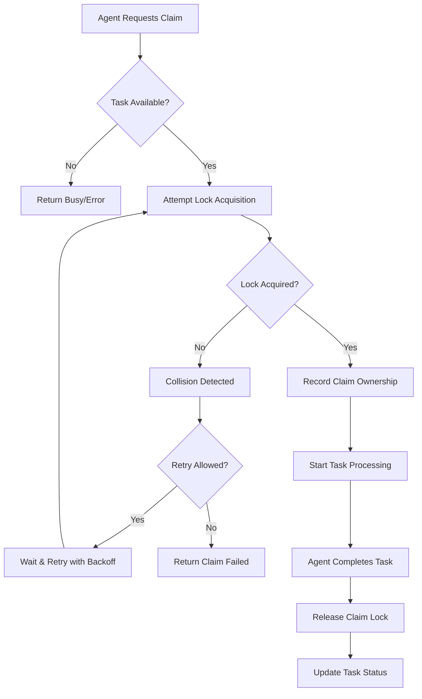

# Agent Claim Coordinator Skill

## Overview

**Skill Name:** `agent_claim_coordinator`
**Domain:** `platinum`
**Purpose:** Coordinate task claims across multiple agents to prevent double work or collisions with distributed locking mechanisms, atomic operations, and collision detection.

**Core Capabilities:**
- Distributed task claim coordination with atomic operations
- Collision detection and prevention mechanisms
- Lock acquisition and release with timeout handling
- Claim retry mechanisms with exponential backoff
- Comprehensive claim logging and audit trails
- Agent status monitoring and health checks
- Fair resource allocation algorithms

**When to Use:**
- Multi-agent environments with shared task queues
- Systems requiring exclusive task ownership
- Scenarios where duplicate work must be prevented
- Distributed systems with competing agents
- Workflows requiring atomic claim operations
- High-availability systems requiring redundancy

**When NOT to Use:**
- Single-agent environments with no concurrency
- Fire-and-forget operations without ownership tracking
- Systems where duplicate processing is acceptable
- Stateful operations that don't require coordination
- Simple linear workflows without competition

---

## Multi-Agent Workflow

### Task Claiming Process
The agent claim coordinator implements a robust claiming process:

1. **Claim Request**: Agent requests to claim a specific task
2. **Availability Check**: Verify task is unclaimed and available
3. **Lock Acquisition**: Attempt to acquire exclusive lock on task
4. **Collision Detection**: Check for simultaneous claim attempts
5. **Claim Confirmation**: Confirm exclusive ownership to agent
6. **Status Update**: Update task status to claimed by specific agent

### Task Release Process
When an agent completes or abandons a task:

1. **Release Request**: Agent signals task completion or abandonment
2. **Ownership Verification**: Confirm releasing agent is current owner
3. **Lock Release**: Release exclusive lock on task
4. **Status Update**: Update task to available or completed state
5. **Notification**: Notify other agents of availability

### Distributed Coordination Algorithm


---

## Claim Logic

### Locking Mechanism
The system implements distributed locking using atomic operations:

1. **Atomic Check-and-Set**: Verify task is unclaimed and claim in single operation
2. **Timestamp-Based Locks**: Include expiration timestamps to handle crashed agents
3. **Unique Claim Identifiers**: Generate UUIDs for each claim to detect stale locks
4. **Lease Renewal**: Allow active agents to renew their claims periodically

### Retry Strategy
When claim attempts fail due to collisions:

1. **Immediate Retry**: Attempt claim again after short delay
2. **Exponential Backoff**: Increase delay between retries (1s, 2s, 4s, 8s...)
3. **Jitter Addition**: Add random component to prevent synchronized retries
4. **Maximum Attempts**: Stop retrying after configurable threshold
5. **Alternative Tasks**: Suggest alternative tasks if retries exhausted

### Timeout Handling
The system handles various timeout scenarios:

1. **Claim Timeout**: Release lock if agent doesn't respond within timeout
2. **Processing Timeout**: Reclaim task if agent doesn't complete within timeframe
3. **Renewal Timeout**: Automatically release lock if agent stops renewing
4. **Graceful Timeout**: Allow agents to extend timeouts under heavy load

---

## Logging Strategy

### Claim Events
All claim activities are logged with comprehensive metadata:

```json
{
  "timestamp": "2026-02-07T10:30:00Z",
  "event_type": "claim_attempt",
  "task_id": "task-12345",
  "agent_id": "agent-alpha",
  "claim_status": "acquired",
  "lock_id": "lock-67890",
  "previous_owner": "agent-beta",
  "collision_detected": false,
  "retry_attempt": 0,
  "correlation_id": "corr-abcde",
  "session_id": "sess-fghij",
  "source_ip": "192.168.1.100"
}
```

### Event Categories
- **Claim Attempts**: Every claim request and outcome
- **Collisions**: Detection and resolution of simultaneous claims
- **Timeouts**: Lock expiration and automatic releases
- **Releases**: Successful and forced claim releases
- **Errors**: Failed operations and exceptional conditions

### Audit Trail Requirements
1. **Complete Chain**: Full history of all claim operations
2. **Agent Accountability**: Clear attribution of all actions
3. **Collision Records**: Detailed logs of any conflicts
4. **Performance Metrics**: Timing and success rate data
5. **Security Events**: Unauthorized claim attempts

---

## Validation Checklist

### Pre-Deployment Validation
- [ ] **Lock Mechanism**: Verify atomic lock operations work correctly
- [ ] **Collision Detection**: Test simultaneous claim scenarios
- [ ] **Timeout Handling**: Validate automatic lock expiration
- [ ] **Retry Logic**: Confirm exponential backoff functions
- [ ] **Network Resilience**: Test with network partitions
- [ ] **Performance Testing**: Validate under expected load
- [ ] **Security Review**: Confirm no unauthorized access possible

### Runtime Validation
- [ ] **No Double Claims**: Verify no task is claimed by multiple agents
- [ ] **Fair Allocation**: Confirm equitable task distribution
- [ ] **Lock Hygiene**: Ensure locks are properly released
- [ ] **Collision Resolution**: Validate conflict handling
- [ ] **Timeout Behavior**: Check automatic cleanup works
- [ ] **Audit Compliance**: Verify all operations logged

### Post-Operation Validation
- [ ] **Claim Success Rate**: Verify high percentage of successful claims
- [ ] **Collision Rate**: Monitor for acceptable collision rates
- [ ] **Resource Utilization**: Confirm efficient resource use
- [ ] **Response Times**: Validate performance meets requirements
- [ ] **Error Handling**: Monitor for acceptable failure rates

---

## Anti-Patterns

### ❌ Anti-Pattern 1: Blind Claims Without Verification
**Problem:** Agents claim tasks without checking current status
**Risk:** Multiple agents may believe they own the same task
**Solution:** Always verify task availability before claiming

**Wrong:**
```python
# Bad: No verification before claiming
def claim_task_blind(agent_id, task_id):
    # Just set the owner without checking
    tasks[task_id]['owner'] = agent_id
    tasks[task_id]['status'] = 'claimed'
    return True
```

**Correct:**
```python
# Good: Verify before claiming
def claim_task_safe(agent_id, task_id):
    # Check current status atomically
    current = get_task_status(task_id)
    if current['status'] != 'available':
        return False  # Task not available
    
    # Attempt atomic claim
    return atomic_claim(task_id, agent_id)
```

---

### ❌ Anti-Pattern 2: Hardcoded Lock Durations
**Problem:** Fixed lock timeouts that don't adapt to task complexity
**Risk:** Either premature lock expiration or prolonged blocking
**Solution:** Use dynamic timeouts based on task characteristics

**Wrong:**
```bash
# Bad: Fixed timeout regardless of task
acquire_lock() {
    TASK_ID="$1"
    AGENT_ID="$2"
    
    # Everyone gets 5 minutes regardless of task
    EXPIRATION=$(($(date +%s) + 300))
    redis-cli SET "lock:$TASK_ID" "$AGENT_ID,$EXPIRATION" NX EX 300
}
```

**Correct:**
```bash
# Good: Dynamic timeout based on task
acquire_lock() {
    TASK_ID="$1"
    AGENT_ID="$2"
    
    # Determine timeout based on task complexity
    TASK_COMPLEXITY=$(get_task_complexity "$TASK_ID")
    case "$TASK_COMPLEXITY" in
        "simple") TIMEOUT=120 ;;    # 2 minutes
        "medium") TIMEOUT=600 ;;    # 10 minutes
        "complex") TIMEOUT=1800 ;;  # 30 minutes
        *) TIMEOUT=300 ;;          # Default 5 minutes
    esac
    
    EXPIRATION=$(($(date +%s) + TIMEOUT))
    redis-cli SET "lock:$TASK_ID" "$AGENT_ID,$EXPIRATION" NX EX "$TIMEOUT"
}
```

---

### ❌ Anti-Pattern 3: Ignoring Lock Release
**Problem:** Agents fail to release locks after completing tasks
**Risk:** Tasks remain locked indefinitely, causing resource starvation
**Solution:** Implement mandatory lock release with cleanup mechanisms

**Wrong:**
```python
# Bad: No guaranteed release
def process_task(agent_id, task_id):
    claim_result = claim_task(agent_id, task_id)
    if not claim_result:
        return False
    
    # Process task - but what if this fails?
    result = perform_task_logic(task_id)
    
    # Task completed, but no guarantee of lock release
    return result
```

**Correct:**
```python
# Good: Guaranteed release with try-finally
def process_task(agent_id, task_id):
    claim_result = claim_task(agent_id, task_id)
    if not claim_result:
        return False
    
    try:
        result = perform_task_logic(task_id)
        return result
    finally:
        # Always release the lock
        release_claim(agent_id, task_id)

# Alternative with context manager
from contextlib import contextmanager

@contextmanager
def claim_context(agent_id, task_id):
    if not claim_task(agent_id, task_id):
        raise Exception("Could not claim task")
    
    try:
        yield
    finally:
        release_claim(agent_id, task_id)

# Usage
with claim_context(agent_id, task_id):
    perform_task_logic(task_id)
```

---

### ❌ Anti-Pattern 4: Inadequate Collision Handling
**Problem:** Poor handling of simultaneous claim attempts
**Risk:** Lost claims, inconsistent state, unfair allocation
**Solution:** Implement proper collision detection and resolution

**Wrong:**
```python
# Bad: No collision handling
def claim_task_simple(task_id, agent_id):
    # Two agents could read the same 'available' status
    current_status = db.get(f"task:{task_id}:status")
    
    if current_status == "available":
        # Both agents might pass this check!
        db.set(f"task:{task_id}:status", "claimed")
        db.set(f"task:{task_id}:owner", agent_id)
        return True
    
    return False
```

**Correct:**
```python
# Good: Atomic operation prevents collisions
def claim_task_atomic(task_id, agent_id):
    # Use atomic compare-and-swap operation
    return db.set(
        f"task:{task_id}:status", 
        "claimed", 
        condition=db.ConditionalSet("==", "available")
    )

# Or using Redis transactions
def claim_task_redis(task_id, agent_id):
    lua_script = """
    if redis.call("GET", KEYS[1]) == ARGV[1] then
        redis.call("SET", KEYS[1], ARGV[2])
        redis.call("SET", KEYS[2], ARGV[3])
        return 1
    else
        return 0
    end
    """
    
    return redis_client.eval(
        lua_script, 
        2, 
        f"task:{task_id}:status", 
        f"task:{task_id}:owner",
        "available", 
        "claimed", 
        agent_id
    )
```

---

### ❌ Anti-Pattern 5: No Stale Lock Detection
**Problem:** Crashed agents leave locks that never get released
**Risk:** Permanent resource blocking
**Solution:** Implement automatic lock expiration and renewal

**Wrong:**
```python
# Bad: No expiration
def acquire_permanent_lock(task_id, agent_id):
    # Lock stays forever if agent crashes
    locks[task_id] = {
        'owner': agent_id,
        'acquired_at': time.time()
    }
    return True
```

**Correct:**
```python
# Good: Automatic expiration
def acquire_timed_lock(task_id, agent_id, ttl_seconds=300):
    lock_info = {
        'owner': agent_id,
        'acquired_at': time.time(),
        'expires_at': time.time() + ttl_seconds,
        'lock_id': str(uuid.uuid4())
    }
    
    # Store with TTL
    redis_client.setex(
        f"lock:{task_id}", 
        ttl_seconds, 
        json.dumps(lock_info)
    )
    
    return lock_info['lock_id']

def renew_lock(task_id, lock_id, extension_seconds=300):
    current_lock = redis_client.get(f"lock:{task_id}")
    if not current_lock:
        return False
    
    lock_info = json.loads(current_lock)
    if lock_info['lock_id'] != lock_id:
        return False  # Different agent owns lock now
    
    # Extend expiration
    lock_info['expires_at'] = time.time() + extension_seconds
    redis_client.setex(
        f"lock:{task_id}", 
        extension_seconds, 
        json.dumps(lock_info)
    )
    
    return True
```

---

## Environment Variables

### Required Variables
```bash
# Lock coordination configuration
LOCK_COORDINATION_BACKEND="redis"          # redis, etcd, zookeeper, database
LOCK_DEFAULT_TIMEOUT="300"                 # Default lock timeout in seconds
CLAIM_RETRY_COUNT="3"                      # Number of retry attempts
CLAIM_RETRY_DELAY="1"                      # Base delay between retries (seconds)
AGENT_ID="agent-$(hostname)-$$"            # Unique agent identifier

# Backend-specific settings
REDIS_URL="redis://localhost:6379"
REDIS_LOCK_NAMESPACE="claims"
```

### Optional Variables
```bash
# Advanced configuration
CLAIM_COLLISION_DETECTION="true"           # Enable collision detection
LOCK_EXTENSION_INTERVAL="60"               # Interval to extend active locks
MAX_LOCK_EXTENSIONS="10"                   # Maximum number of extensions
CLAIM_AUDIT_LOG="/var/log/claim-audit.log" # Audit log path
METRICS_ENABLED="true"                     # Enable metrics collection
METRICS_PORT="9090"                        # Prometheus metrics port
HEALTH_CHECK_PATH="/health"                # Health check endpoint
```

---

## Integration Points

### Claim Request Interface
Agents request task claims through:
- REST API endpoint for claim requests
- Message queue for asynchronous claims
- Direct function calls in integrated systems

### Status Monitoring Interface
System monitors claim status through:
- Real-time status API
- Event stream notifications
- Periodic polling endpoints

### Lock Management Interface
Administrative lock operations through:
- Force unlock for stuck tasks
- Lock inspection and debugging
- Bulk operations for maintenance

---

## Performance Considerations

### Latency Optimization
- Minimize lock acquisition time
- Use efficient collision detection
- Optimize backend communication

### Scalability Factors
- Distributed lock coordination
- Efficient collision handling
- Asynchronous claim processing

### Resource Management
- Monitor lock contention
- Prevent resource exhaustion
- Implement graceful degradation

---

**Version:** 1.0.0
**Last Updated:** 2026-02-07
**Maintainer:** Platinum Team