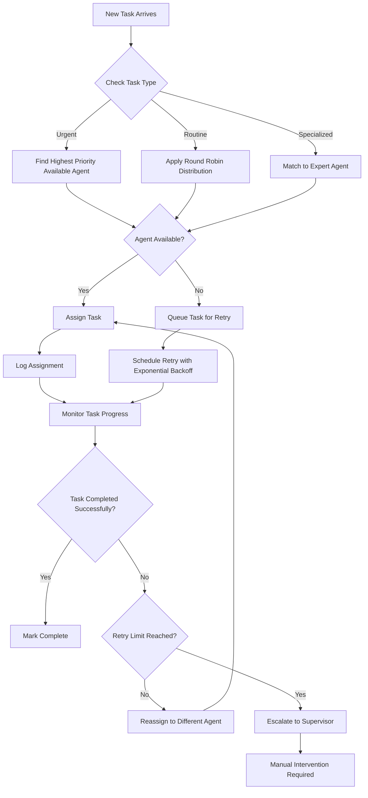

# Agent Delegation Manager Skill

## Overview

**Skill Name:** `agent_delegation_manager`
**Domain:** `platinum`
**Purpose:** Manage task handoffs between multiple agents to ensure no agent is idle and tasks are routed efficiently with dynamic load balancing, availability monitoring, and intelligent delegation logic.

**Core Capabilities:**
- Dynamic task routing based on agent availability and expertise
- Agent availability monitoring and health checks
- Intelligent task assignment with load balancing
- Task retry and escalation mechanisms
- Comprehensive delegation logging and audit trails
- Failover and redundancy management
- Performance metrics and delegation analytics

**When to Use:**
- Multi-agent environments with task distribution requirements
- Systems requiring load balancing across multiple agents
- Scenarios where agent downtime must be handled gracefully
- Workflows with varying task complexity requiring specialized agents
- High-availability systems requiring redundancy
- Scalable task processing systems

**When NOT to Use:**
- Single-agent environments with no concurrency
- Simple linear workflows without task distribution
- Systems where task ownership must remain static
- Situations where direct agent-task assignment is preferred
- Low-latency real-time systems where delegation overhead is problematic

---

## Multi-Agent Workflow

### Task Routing Logic
The agent delegation manager implements intelligent task routing based on multiple factors:

1. **Agent Availability**: Checks current workload and availability status
2. **Expertise Matching**: Routes tasks to agents with appropriate specialization
3. **Load Balancing**: Distributes tasks to prevent overloading any single agent
4. **Priority Handling**: Higher priority tasks are routed to available agents first
5. **Geographic Proximity**: When applicable, routes to geographically optimal agents

### Agent Availability Checks
The system performs continuous monitoring of agent availability through:

1. **Heartbeat Mechanism**: Agents periodically report their status
2. **Workload Assessment**: Monitors current task queue and processing capacity
3. **Health Probes**: Verifies agent responsiveness and resource availability
4. **Capability Verification**: Confirms agent has required skills for specific tasks
5. **Performance Metrics**: Tracks agent response times and success rates

### Dynamic Assignment Algorithm


---

## Delegation Logic

### Task Assignment Process
1. **Task Classification**: Categorize task by type, priority, and complexity
2. **Agent Profiling**: Evaluate available agents based on skills and current load
3. **Optimal Selection**: Choose best-fit agent using weighted scoring algorithm
4. **Assignment Confirmation**: Verify agent accepts and begins processing
5. **Status Tracking**: Monitor task progress and agent performance

### Retry Mechanism
When task assignment fails or an agent becomes unavailable:

1. **Immediate Retry**: Attempt reassignment to different available agent
2. **Exponential Backoff**: Increase delay between retry attempts
3. **Escalation Path**: Move to higher-tier agents if lower tiers fail
4. **Fallback Strategy**: Use generalist agents for unassigned tasks
5. **Timeout Handling**: Escalate to human operator after threshold

### Escalation Procedures
Tasks are escalated based on:

1. **Priority Thresholds**: High-priority tasks escalate faster
2. **Failure Count**: Repeated failures trigger escalation
3. **Time Limits**: Tasks exceeding time thresholds escalate
4. **Resource Constraints**: Insufficient resources trigger escalation
5. **Expertise Gaps**: Lack of required skills triggers escalation

---

## Logging Strategy

### Delegation Events
All delegation activities are logged with comprehensive metadata:

```json
{
  "timestamp": "2026-02-07T10:30:00Z",
  "event_type": "task_delegated",
  "task_id": "task-12345",
  "task_type": "data_processing",
  "task_priority": "high",
  "original_agent": "agent-alpha",
  "target_agent": "agent-beta",
  "delegation_reason": "original_agent_unavailable",
  "delegation_strategy": "failover",
  "estimated_completion": "2026-02-07T11:30:00Z",
  "correlation_id": "corr-67890",
  "session_id": "sess-abcde",
  "source_ip": "192.168.1.100"
}
```

### Traceability Requirements
1. **Full Chain Tracking**: Every task handoff is recorded with timestamps
2. **Agent Status Logs**: Continuous logging of agent availability and load
3. **Performance Metrics**: Response times, success rates, and throughput
4. **Error Tracking**: Detailed logs of all delegation failures and retries
5. **Audit Trail**: Complete history of all delegation decisions for compliance

### Log Categories
- **Delegation Events**: Task assignments, reassignments, and completions
- **Agent Health**: Availability, performance, and capacity metrics
- **System Metrics**: Throughput, latency, and resource utilization
- **Error Logs**: Failures, timeouts, and exceptional conditions
- **Security Events**: Unauthorized access attempts and privilege escalations

---

## Validation Checklist

### Pre-Deployment Validation
- [ ] **Agent Registry**: Verify all participating agents are registered and accessible
- [ ] **Network Connectivity**: Confirm agents can communicate with delegation manager
- [ ] **Authentication**: Validate secure communication channels between agents
- [ ] **Configuration**: Verify delegation rules and priority settings
- [ ] **Capacity Planning**: Ensure sufficient agents for expected workload
- [ ] **Failover Testing**: Test agent failure and recovery scenarios
- [ ] **Load Testing**: Validate performance under expected peak loads
- [ ] **Security Review**: Confirm no hardcoded credentials or secrets

### Runtime Validation
- [ ] **No Task Dropping**: Verify all tasks are assigned to an agent
- [ ] **No Idle Agents**: Monitor that agents receive appropriate workload
- [ ] **Correct Routing**: Validate tasks are routed to appropriate agents
- [ ] **Timely Processing**: Ensure tasks complete within SLA timeframes
- [ ] **Error Handling**: Confirm proper handling of agent failures
- [ ] **Resource Utilization**: Monitor efficient use of agent resources
- [ ] **Audit Compliance**: Verify all delegations are logged properly

### Post-Operation Validation
- [ ] **Task Completion Rate**: Verify high percentage of successful completions
- [ ] **Load Distribution**: Confirm balanced workload across agents
- [ ] **Response Times**: Validate performance meets requirements
- [ ] **Error Rates**: Monitor for acceptable failure rates
- [ ] **Scalability**: Verify system handles increased loads appropriately

---

## Anti-Patterns

### ❌ Anti-Pattern 1: Hardcoded Agent IDs
**Problem:** Embedding specific agent IDs directly in routing logic
**Risk:** Creates tight coupling and reduces flexibility
**Solution:** Use dynamic agent discovery and capability-based routing

**Wrong:**
```python
# Bad: Hardcoded agent assignment
def route_task(task):
    if task.type == "data_processing":
        return "agent-001"  # Fixed assignment
    elif task.type == "report_generation":
        return "agent-002"  # Fixed assignment
```

**Correct:**
```python
# Good: Capability-based routing
def route_task(task):
    required_capabilities = get_task_requirements(task)
    available_agents = find_agents_with_capabilities(required_capabilities)
    return select_optimal_agent(available_agents, task.priority)
```

---

### ❌ Anti-Pattern 2: Blind Delegation Without Validation
**Problem:** Assigning tasks without verifying agent capability or availability
**Risk:** Tasks fail, get lost, or overwhelm agents
**Solution:** Perform capability and availability checks before delegation

**Wrong:**
```bash
# Bad: No validation before assignment
assign_task_to_agent() {
    AGENT_ID=$(get_random_agent)
    send_task "$AGENT_ID" "$TASK_DATA"  # No checks performed
}
```

**Correct:**
```bash
# Good: Validation before assignment
assign_task_to_agent() {
    local task="$1"
    local agent=$(find_available_agent_for_task "$task")
    
    if [[ -z "$agent" ]]; then
        log_error "No available agent for task: $task"
        return 1
    fi
    
    if verify_agent_capability "$agent" "$task"; then
        send_task "$agent" "$TASK_DATA"
        log_assignment "$task" "$agent"
    else
        log_error "Agent $agent lacks capability for task $task"
        return 1
    fi
}
```

---

### ❌ Anti-Pattern 3: No Fallback Strategy
**Problem:** Failing completely when primary agent is unavailable
**Risk:** Task loss and service disruption
**Solution:** Implement progressive fallback and escalation

**Wrong:**
```python
# Bad: No fallback
def assign_task(task):
    primary_agent = get_primary_agent(task)
    if primary_agent.is_available():
        return delegate_to_agent(primary_agent, task)
    else:
        raise Exception("Primary agent unavailable")  # Task lost!
```

**Correct:**
```python
# Good: Progressive fallback
def assign_task(task):
    agents = get_agents_in_priority_order(task)
    
    for agent in agents:
        if agent.is_available() and verify_capability(agent, task):
            return delegate_to_agent(agent, task)
    
    # All agents unavailable - escalate
    escalate_task(task, "all_agents_unavailable")
    return False
```

---

### ❌ Anti-Pattern 4: Infinite Retry Loops
**Problem:** Retrying failed assignments indefinitely without limits
**Risk:** Resource exhaustion and system instability
**Solution:** Implement bounded retry with exponential backoff

**Wrong:**
```bash
# Bad: Infinite retry
retry_assignment() {
    local task_id="$1"
    while true; do
        if attempt_assignment "$task_id"; then
            return 0
        fi
        sleep 1  # Constant delay - inefficient
    done
}
```

**Correct:**
```bash
# Good: Bounded retry with backoff
retry_assignment() {
    local task_id="$1"
    local max_attempts="${TASK_MAX_RETRY:-5}"
    local base_delay="${RETRY_BASE_DELAY:-1}"
    
    for attempt in $(seq 1 $max_attempts); do
        if attempt_assignment "$task_id"; then
            log_info "Assignment succeeded on attempt $attempt"
            return 0
        fi
        
        # Exponential backoff
        local delay=$(echo "$base_delay * (2 ^ ($attempt - 1))" | bc)
        log_warn "Attempt $attempt failed, retrying in ${delay}s"
        sleep "$delay"
    done
    
    log_error "Max retry attempts reached for task $task_id"
    return 1
}
```

---

### ❌ Anti-Pattern 5: Poor Visibility and Monitoring
**Problem:** Inadequate tracking of delegation decisions and outcomes
**Risk:** Difficult to debug issues and optimize performance
**Solution:** Comprehensive logging and monitoring of all delegation activities

**Wrong:**
```python
# Bad: Minimal logging
def delegate_task(task, agent):
    agent.process(task)
    # No tracking of what happened
```

**Correct:**
```python
# Good: Comprehensive tracking
def delegate_task(task, agent):
    start_time = time.time()
    assignment_id = generate_assignment_id()
    
    log_assignment_start(assignment_id, task.id, agent.id, start_time)
    
    try:
        result = agent.process(task)
        duration = time.time() - start_time
        
        log_assignment_success(
            assignment_id=assignment_id,
            task_id=task.id,
            agent_id=agent.id,
            duration=duration,
            result_summary=str(result)[:100]  # Truncate long results
        )
        
        return result
    except Exception as e:
        duration = time.time() - start_time
        log_assignment_failure(
            assignment_id=assignment_id,
            task_id=task.id,
            agent_id=agent.id,
            duration=duration,
            error=str(e)
        )
        raise
```

---

## Environment Variables

### Required Variables
```bash
# Agent registry configuration
AGENT_REGISTRY_URL="http://agent-registry:8080"
AGENT_HEARTBEAT_INTERVAL="30"           # Heartbeat interval in seconds
AGENT_AVAILABILITY_TIMEOUT="120"        # Timeout for agent unresponsiveness

# Delegation configuration
DELEGATION_STRATEGY="round_robin"       # round_robin, priority_based, load_balanced
TASK_ASSIGNMENT_TIMEOUT="60"            # Timeout for task assignment
MAX_TASK_RETRIES="3"                    # Maximum retry attempts per task
TASK_RETRY_BACKOFF_FACTOR="2"           # Exponential backoff factor
```

### Optional Variables
```bash
# Advanced configuration
AGENT_SELECTION_TIMEOUT="10"            # Timeout for agent selection process
TASK_ESCALATION_THRESHOLD="300"         # Seconds before escalating task
MONITORING_ENABLED="true"               # Enable metrics collection
LOG_LEVEL="info"                        # Log verbosity level
AUDIT_LOG_PATH="/var/log/delegation-audit.log"
METRICS_PUSH_GATEWAY="http://prometheus:9091"
HEALTH_CHECK_PATH="/health"             # Endpoint for health checks
```

---

## Integration Points

### Agent Registration Interface
Agents register their capabilities and availability through:
- REST API endpoint for capability reporting
- WebSocket connection for real-time status updates
- Periodic heartbeat mechanism

### Task Submission Interface
External systems submit tasks through:
- REST API with JSON payload
- Message queue integration
- Batch processing interface

### Monitoring Interface
System metrics and logs are available through:
- Prometheus metrics endpoint
- Structured log output
- Real-time dashboard API

---

## Performance Considerations

### Latency Optimization
- Minimize delegation decision time
- Cache agent availability information
- Optimize network communication

### Scalability Factors
- Horizontal scaling of delegation manager
- Efficient agent discovery algorithms
- Asynchronous task processing

### Resource Management
- Monitor agent resource utilization
- Prevent overloading individual agents
- Implement graceful degradation

---

**Version:** 1.0.0
**Last Updated:** 2026-02-07
**Maintainer:** Platinum Team