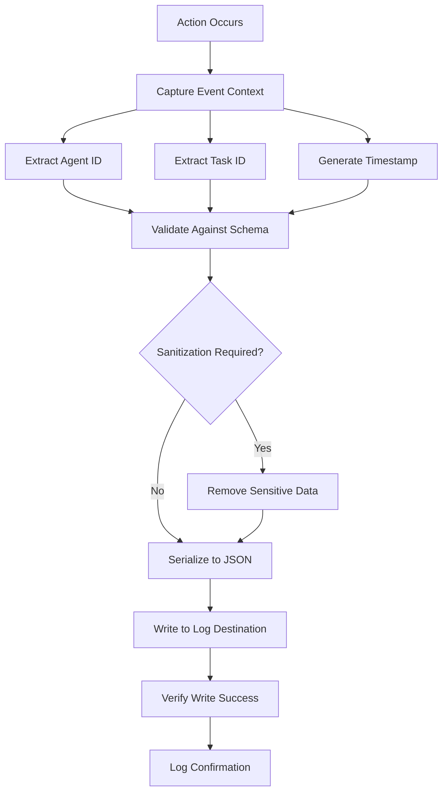

# Audit Log Writer Skill

## Overview

**Skill Name:** `audit_log_writer`
**Domain:** `platinum`
**Purpose:** Maintain structured JSON action logs for compliance, debugging, and traceability with consistent schema, timestamping, and comprehensive event tracking.

**Core Capabilities:**
- Structured JSON logging with standardized schema
- Timestamp-based event ordering and correlation
- Agent and task identification for traceability
- Compliance-ready audit trails with immutable records
- Configurable log destinations and retention
- Real-time log validation and sanitization
- Performance-optimized logging with batching capabilities

**When to Use:**
- Systems requiring compliance with regulatory standards
- Applications needing detailed audit trails
- Multi-agent environments requiring action tracking
- Debugging complex workflows and state changes
- Security-sensitive operations requiring audit logs
- Enterprise systems with governance requirements

**When NOT to Use:**
- Performance-critical systems where logging overhead is prohibitive
- Simple applications without compliance or audit requirements
- Systems with strict privacy constraints preventing detailed logging
- Embedded systems with limited storage capabilities
- Applications where log volume would exceed storage quotas

---

## Logging Workflow

### Event Capture Process
The audit log writer implements a comprehensive event capture process:

1. **Event Detection**: Identify actions requiring audit logging
2. **Context Extraction**: Gather relevant metadata (agent, task, timestamp)
3. **Schema Validation**: Ensure event conforms to standard format
4. **Sanitization**: Remove sensitive information if needed
5. **Serialization**: Format event as structured JSON
6. **Storage**: Write to configured log destination
7. **Confirmation**: Verify successful write operation

### Standard Event Flow


### Metadata Collection
For each auditable action, the system collects:

- **Agent Identifier**: Unique ID of the agent performing the action
- **Task Identifier**: ID of the task being operated on
- **Action Type**: Classification of the action taken
- **Timestamp**: Precise time of the action (ISO 8601 format)
- **Source IP**: Originating IP address (when applicable)
- **Session ID**: Correlation ID for multi-step operations
- **Outcome**: Success/failure status of the action
- **Additional Context**: Action-specific metadata

---

## JSON Schema

### Standard Log Entry Format
All audit logs follow this standardized JSON schema:

```json
{
  "$schema": "https://json-schema.org/draft/2020-12/schema",
  "type": "object",
  "title": "Audit Log Entry",
  "required": ["timestamp", "agent_id", "action", "outcome"],
  "properties": {
    "timestamp": {
      "type": "string",
      "format": "date-time",
      "description": "ISO 8601 timestamp of the event"
    },
    "agent_id": {
      "type": "string",
      "pattern": "^agent-[a-zA-Z0-9-_]+$",
      "description": "Unique identifier of the agent performing the action"
    },
    "task_id": {
      "type": "string",
      "description": "Identifier of the task being operated on (optional)"
    },
    "action": {
      "type": "string",
      "enum": [
        "task_created", "task_claimed", "task_started", "task_completed", 
        "task_failed", "task_released", "config_changed", "access_granted", 
        "access_denied", "data_accessed", "data_modified", "system_event"
      ],
      "description": "Type of action being logged"
    },
    "outcome": {
      "type": "string",
      "enum": ["success", "failure", "partial"],
      "description": "Result of the action"
    },
    "source_ip": {
      "type": "string",
      "format": "ipv4",
      "description": "IP address of the request originator"
    },
    "session_id": {
      "type": "string",
      "description": "Correlation ID for multi-step operations"
    },
    "correlation_id": {
      "type": "string",
      "description": "Additional correlation identifier"
    },
    "metadata": {
      "type": "object",
      "description": "Action-specific contextual information"
    },
    "version": {
      "type": "string",
      "description": "Schema version for the log entry"
    }
  }
}
```

### Example Log Entries
```json
{
  "timestamp": "2026-02-07T10:30:00.123Z",
  "agent_id": "agent-web-worker-01",
  "task_id": "task-12345",
  "action": "task_claimed",
  "outcome": "success",
  "source_ip": "192.168.1.100",
  "session_id": "sess-abc123def456",
  "correlation_id": "corr-xyz789",
  "metadata": {
    "previous_owner": "agent-processor-02",
    "claim_strategy": "load_balanced"
  },
  "version": "1.0.0"
}
```

---

## Validation Checklist

### Pre-Deployment Validation
- [ ] **Schema Compliance**: Verify all log entries conform to standard schema
- [ ] **Timestamp Accuracy**: Confirm timestamps are precise and in UTC
- [ ] **Agent Identification**: Validate agent IDs follow required format
- [ ] **Log Destination**: Test write access to configured log storage
- [ ] **Retention Policy**: Verify log retention settings are appropriate
- [ ] **Performance Impact**: Assess logging overhead on system performance
- [ ] **Security Review**: Confirm sensitive data is properly sanitized
- [ ] **Backup Configuration**: Test log backup and archival procedures

### Runtime Validation
- [ ] **Complete Coverage**: Ensure all auditable actions are logged
- [ ] **Schema Validation**: Verify all logs match required schema
- [ ] **Timestamp Consistency**: Confirm timestamps are accurate and sequential
- [ ] **Agent Identity**: Validate agent IDs are properly recorded
- [ ] **Task Correlation**: Ensure task IDs are captured when applicable
- [ ] **Outcome Recording**: Verify success/failure outcomes are logged
- [ ] **Metadata Completeness**: Check that required metadata is present
- [ ] **Storage Health**: Monitor log storage for space and accessibility

### Post-Operation Validation
- [ ] **Log Integrity**: Verify logs have not been tampered with
- [ ] **Search Functionality**: Confirm logs can be queried effectively
- [ ] **Compliance Adherence**: Validate logs meet regulatory requirements
- [ ] **Performance Metrics**: Monitor logging impact on system performance
- [ ] **Retention Compliance**: Verify old logs are properly archived/expired
- [ ] **Backup Integrity**: Test restoration of archived logs

---

## Anti-Patterns

### ❌ Anti-Pattern 1: Missing Timestamps
**Problem:** Audit logs without proper timestamps
**Risk:** Impossible to reconstruct event sequences or correlate events
**Solution:** Always include ISO 8601 formatted timestamps in UTC

**Wrong:**
```python
# Bad: No timestamp
def log_action(agent_id, task_id, action):
    log_entry = {
        "agent_id": agent_id,
        "task_id": task_id,
        "action": action
        # Missing timestamp!
    }
    write_log(log_entry)
```

**Correct:**
```python
# Good: Proper timestamp inclusion
from datetime import datetime
import pytz

def log_action(agent_id, task_id, action):
    log_entry = {
        "timestamp": datetime.now(pytz.UTC).isoformat(),
        "agent_id": agent_id,
        "task_id": task_id,
        "action": action,
        "outcome": "success"
    }
    write_log(log_entry)
```

---

### ❌ Anti-Pattern 2: Inconsistent JSON Schema
**Problem:** Different parts of the system use different log formats
**Risk:** Complicates log analysis and compliance reporting
**Solution:** Enforce standardized schema across all logging points

**Wrong:**
```python
# Bad: Inconsistent field names and structure
def log_task_creation(task_id):
    log_entry = {
        "when": time.time(),  # Unix timestamp instead of ISO 8601
        "who": "agent-123",  # Inconsistent field name
        "what": "create_task",  # Inconsistent field name
        "task_id": task_id
    }
    write_log(log_entry)

def log_task_completion(task_id):
    log_entry = {
        "timestamp": datetime.now().isoformat(),  # Good
        "agent_id": "agent-123",  # Good
        "action": "complete_task",  # Good
        "taskId": task_id  # Different field name!
    }
    write_log(log_entry)
```

**Correct:**
```python
# Good: Consistent schema across all logging points
def log_task_creation(task_id):
    log_entry = {
        "timestamp": datetime.now(pytz.UTC).isoformat(),
        "agent_id": "agent-123",
        "task_id": task_id,
        "action": "task_created",
        "outcome": "success"
    }
    write_log(log_entry)

def log_task_completion(task_id):
    log_entry = {
        "timestamp": datetime.now(pytz.UTC).isoformat(),
        "agent_id": "agent-123",
        "task_id": task_id,
        "action": "task_completed",
        "outcome": "success"
    }
    write_log(log_entry)
```

---

### ❌ Anti-Pattern 3: Hardcoded Log Paths
**Problem:** Log file paths embedded directly in code
**Risk:** Makes deployment and configuration management difficult
**Solution:** Use configurable log destinations

**Wrong:**
```python
# Bad: Hardcoded path
def write_log(entry):
    with open("/var/log/audit/app-audit.log", "a") as f:  # Hardcoded!
        f.write(json.dumps(entry) + "\n")
```

**Correct:**
```python
# Good: Configurable destination
import os

def write_log(entry):
    log_path = os.environ.get("AUDIT_LOG_PATH", "./audit.log")
    with open(log_path, "a") as f:
        f.write(json.dumps(entry) + "\n")
```

---

### ❌ Anti-Pattern 4: Insufficient Context Information
**Problem:** Logs lack sufficient detail for debugging
**Risk:** Unable to reconstruct events or diagnose issues
**Solution:** Include comprehensive context in all log entries

**Wrong:**
```python
# Bad: Minimal information
def log_task_claim(agent_id, task_id):
    log_entry = {
        "timestamp": datetime.now(pytz.UTC).isoformat(),
        "agent_id": agent_id,
        "action": "task_claim"
    }
    # Missing task_id and outcome!
    write_log(log_entry)
```

**Correct:**
```python
# Good: Comprehensive context
def log_task_claim(agent_id, task_id, success=True):
    log_entry = {
        "timestamp": datetime.now(pytz.UTC).isoformat(),
        "agent_id": agent_id,
        "task_id": task_id,
        "action": "task_claimed",
        "outcome": "success" if success else "failure",
        "metadata": {
            "strategy": "load_balanced",
            "previous_owner": get_previous_owner(task_id) if not success else None
        }
    }
    write_log(log_entry)
```

---

### ❌ Anti-Pattern 5: No Log Validation
**Problem:** Writing malformed logs without validation
**Risk:** Corrupts log data and complicates analysis
**Solution:** Validate log entries before writing

**Wrong:**
```python
# Bad: No validation
def write_audit_log(entry):
    # Write whatever comes in without validation
    with open(LOG_PATH, "a") as f:
        f.write(json.dumps(entry) + "\n")
```

**Correct:**
```python
# Good: Schema validation
import jsonschema

AUDIT_SCHEMA = {
    "type": "object",
    "required": ["timestamp", "agent_id", "action", "outcome"],
    "properties": {
        "timestamp": {"type": "string", "format": "date-time"},
        "agent_id": {"type": "string"},
        "action": {"type": "string"},
        "outcome": {"type": "string", "enum": ["success", "failure", "partial"]}
    }
}

def write_audit_log(entry):
    try:
        jsonschema.validate(entry, AUDIT_SCHEMA)
        with open(LOG_PATH, "a") as f:
            f.write(json.dumps(entry) + "\n")
    except jsonschema.ValidationError as e:
        # Log the validation error for debugging
        error_log = {
            "timestamp": datetime.now(pytz.UTC).isoformat(),
            "agent_id": "system",
            "action": "log_validation_error",
            "outcome": "failure",
            "metadata": {"validation_error": str(e), "entry": str(entry)}
        }
        with open(ERROR_LOG_PATH, "a") as f:
            f.write(json.dumps(error_log) + "\n")
```

---

## Environment Variables

### Required Variables
```bash
# Log configuration
AUDIT_LOG_PATH="/var/log/audit/app-audit.log"    # Path to audit log file
AUDIT_LOG_LEVEL="info"                           # Log level (debug, info, warn, error)
AUDIT_LOG_FORMAT="json"                          # Output format (json, text)

# Agent identification
AGENT_ID="agent-$(hostname)-$$"                  # Unique agent identifier
SESSION_ID="$(uuidgen)"                          # Session identifier
```

### Optional Variables
```bash
# Advanced configuration
AUDIT_LOG_RETENTION_DAYS="90"                    # Days to retain logs
AUDIT_LOG_MAX_SIZE_MB="100"                     # Max log file size before rotation
AUDIT_LOG_COMPRESSION="true"                     # Compress rotated logs
AUDIT_LOG_FLUSH_INTERVAL="5"                     # Flush interval in seconds
AUDIT_SCHEMA_VALIDATION="true"                   # Enable schema validation
AUDIT_SANITIZE_SENSITIVE_DATA="true"             # Sanitize sensitive information
AUDIT_REMOTE_ENDPOINT=""                         # Remote logging endpoint (if any)
AUDIT_REMOTE_TIMEOUT="30"                        # Timeout for remote logging
```

---

## Integration Points

### Logging Interface
Applications integrate with audit logging through:
- Function/method calls for logging events
- Decorators for automatic method logging
- Middleware for HTTP request logging

### Log Storage Interface
System supports multiple log destinations:
- Local file system with rotation
- Remote logging services (Syslog, Splunk, etc.)
- Cloud-based log management (CloudWatch, etc.)

### Query Interface
Logs can be queried through:
- Standard file system tools
- Log aggregation services
- Compliance and security monitoring tools

---

## Performance Considerations

### Asynchronous Logging
- Use non-blocking I/O for log writes
- Implement buffering and batching
- Consider separate logging threads/processes

### Storage Optimization
- Implement efficient log rotation
- Use compression for archived logs
- Optimize disk I/O patterns

### Schema Validation
- Cache compiled schemas
- Validate only critical fields in hot paths
- Consider validation level based on log importance

---

**Version:** 1.0.0
**Last Updated:** 2026-02-07
**Maintainer:** Platinum Team