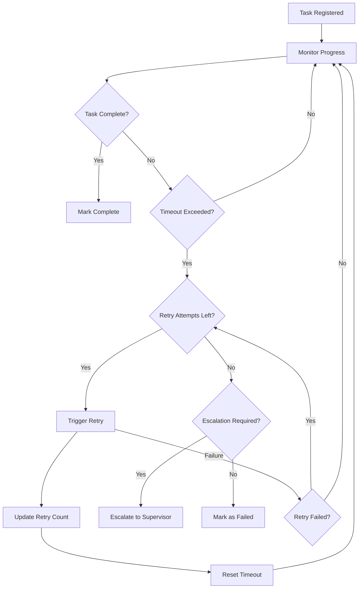

# Ralph Wiggum Loop Controller Skill

## Overview

**Skill Name:** `ralph_wiggum_loop_controller`
**Domain:** `platinum`
**Purpose:** Monitor tasks and enforce completion loops, triggering retries or escalations for stuck/incomplete tasks with intelligent timeout detection, heartbeat monitoring, and adaptive retry mechanisms.

**Core Capabilities:**
- Intelligent task monitoring with timeout detection
- Adaptive retry mechanisms with exponential backoff
- Escalation workflows for stuck tasks
- Agent heartbeat monitoring and health checks
- Task lifecycle tracking and completion enforcement
- Configurable retry policies and escalation rules
- Real-time alerting for stuck tasks

**When to Use:**
- Systems with long-running tasks requiring completion guarantees
- Workflows with potential for task stalling or hanging
- Multi-agent environments requiring task coordination
- Applications needing reliable task completion
- Systems with critical tasks that must not fail silently
- Environments with unreliable network or compute resources

**When NOT to Use:**
- Short-lived tasks that complete quickly
- Fire-and-forget operations without completion requirements
- Systems where task failure is acceptable
- Applications with strict real-time requirements
- Simple linear workflows without complex dependencies

---

## Workflow

### Task Monitoring Process
The Ralph Wiggum Loop Controller implements a comprehensive monitoring workflow:

1. **Task Registration**: New tasks are registered with the controller
2. **Initial Assessment**: Task timeout and retry parameters are evaluated
3. **Continuous Monitoring**: Task progress is tracked against expectations
4. **Anomaly Detection**: Stuck or stalled tasks are identified
5. **Intervention**: Appropriate action is taken (retry, escalation, etc.)
6. **Resolution**: Task completion or failure is confirmed
7. **Cleanup**: Monitoring resources are released

### Retry and Escalation Workflow


### Intervention Strategies
When tasks become stuck, the system employs multiple intervention strategies:

1. **Soft Retry**: Attempt to restart the task with same parameters
2. **Hard Retry**: Reassign task to different agent/resource
3. **Timeout Extension**: Extend deadline for long-running tasks
4. **Escalation**: Forward to supervisor or human operator
5. **Fallback**: Execute alternative task implementation

---

## Monitoring Logic

### Timestamp-Based Monitoring
The system tracks multiple timestamps for each task:

- **Created**: When the task was initially registered
- **Started**: When the task began execution
- **Last Activity**: When the task last reported progress
- **Deadline**: When the task is expected to complete
- **Next Check**: When to next verify task status

### Agent Heartbeat Monitoring
The system continuously monitors agent health through:

- **Periodic Heartbeats**: Agents report their status regularly
- **Task Acknowledgment**: Agents confirm task receipt and processing
- **Resource Utilization**: Monitoring CPU, memory, and network usage
- **Responsiveness Checks**: Verifying agents can respond to requests

### Anomaly Detection
The system identifies anomalies through:

- **Progress Stagnation**: No progress updates for extended periods
- **Resource Exhaustion**: Agent running out of memory or CPU
- **Communication Breakdown**: Failed heartbeats or acknowledgments
- **Performance Degradation**: Significant slowdown in task processing

---

## Validation Checklist

### Pre-Deployment Validation
- [ ] **Timeout Configuration**: Verify timeout values are appropriate for task types
- [ ] **Retry Policies**: Confirm retry logic is properly configured
- [ ] **Escalation Paths**: Validate escalation procedures are defined
- [ ] **Monitoring Intervals**: Check monitoring frequency is appropriate
- [ ] **Alerting Configuration**: Ensure alerting mechanisms are set up
- [ ] **Performance Impact**: Assess monitoring overhead on system performance
- [ ] **Security Review**: Confirm access controls for monitoring functions
- [ ] **Backup Procedures**: Test backup and recovery of monitoring data

### Runtime Validation
- [ ] **Task Completion**: Verify all tasks eventually complete or fail appropriately
- [ ] **Stuck Task Detection**: Confirm stuck tasks are identified promptly
- [ ] **Retry Effectiveness**: Validate retries resolve issues appropriately
- [ ] **Escalation Triggering**: Ensure escalations happen when needed
- [ ] **Resource Utilization**: Monitor monitoring overhead
- [ ] **Alert Accuracy**: Verify alerts are triggered correctly
- [ ] **False Positive Rate**: Check for inappropriate interventions
- [ ] **System Stability**: Ensure monitoring doesn't destabilize system

### Post-Operation Validation
- [ ] **Completion Rate**: Verify high percentage of task completions
- [ ] **Average Resolution Time**: Confirm timely resolution of stuck tasks
- [ ] **Retry Success Rate**: Validate effectiveness of retry mechanisms
- [ ] **Escalation Frequency**: Monitor escalation rates for optimization
- [ ] **Performance Metrics**: Validate system performance meets requirements
- [ ] **Error Handling**: Confirm appropriate handling of all error conditions

---

## Anti-Patterns

### ❌ Anti-Pattern 1: Ignoring Stuck Tasks
**Problem:** Failing to detect and handle tasks that become stuck
**Risk:** Tasks remain incomplete indefinitely, causing resource waste and system degradation
**Solution:** Implement comprehensive monitoring with configurable timeouts

**Wrong:**
```python
# Bad: No monitoring of task progress
def process_task(task_id):
    # Start task processing
    result = perform_long_running_operation(task_id)
    return result

# Tasks can hang indefinitely without detection
```

**Correct:**
```python
# Good: Active monitoring with timeout
import threading
import time

class TaskMonitor:
    def __init__(self, timeout_seconds=300):
        self.timeout_seconds = timeout_seconds
        self.task_start_times = {}
        self.monitoring_threads = {}
    
    def start_monitoring(self, task_id):
        self.task_start_times[task_id] = time.time()
        
        # Start monitoring thread
        monitor_thread = threading.Thread(
            target=self._monitor_task,
            args=(task_id,),
            daemon=True
        )
        monitor_thread.start()
        self.monitoring_threads[task_id] = monitor_thread
    
    def _monitor_task(self, task_id):
        while True:
            time.sleep(30)  # Check every 30 seconds
            
            if time.time() - self.task_start_times[task_id] > self.timeout_seconds:
                self._handle_timeout(task_id)
                break
    
    def _handle_timeout(self, task_id):
        print(f"Task {task_id} timed out, triggering intervention")
        # Implement retry or escalation logic
```

---

### ❌ Anti-Pattern 2: Hardcoded Retry Limits
**Problem:** Fixed retry counts that don't adapt to different task types or failure patterns
**Risk:** Either too many retries for unrecoverable errors or too few for transient issues
**Solution:** Use configurable retry policies based on task type and failure characteristics

**Wrong:**
```python
# Bad: Fixed retry count regardless of task type
def process_with_retry(task_id):
    max_retries = 3  # Always 3 retries
    
    for attempt in range(max_retries + 1):
        try:
            return perform_task(task_id)
        except Exception as e:
            if attempt == max_retries:
                raise  # Final attempt failed
            time.sleep(5)  # Fixed delay
```

**Correct:**
```python
# Good: Configurable retry policy
def process_with_retry(task_id, task_type="default"):
    # Get policy based on task type
    policy = get_retry_policy(task_type)
    
    for attempt in range(policy.max_retries + 1):
        try:
            return perform_task(task_id)
        except Exception as e:
            if attempt == policy.max_retries:
                raise  # Final attempt failed
            
            # Use exponential backoff with jitter
            delay = policy.base_delay * (2 ** attempt)
            jitter = random.uniform(0, delay * 0.1)  # 10% jitter
            time.sleep(delay + jitter)
```

---

### ❌ Anti-Pattern 3: Skipping Alert Notifications
**Problem:** Not alerting operators when tasks become stuck or repeatedly fail
**Risk:** Issues go unnoticed, leading to degraded service or data inconsistency
**Solution:** Implement comprehensive alerting for stuck tasks and repeated failures

**Wrong:**
```python
# Bad: Silent failure handling
def handle_stuck_task(task_id):
    # Maybe log to file, but no notification
    print(f"Task {task_id} appears stuck")
    # No alert sent to operators
```

**Correct:**
```python
# Good: Comprehensive alerting
def handle_stuck_task(task_id, agent_id, task_details):
    # Log detailed information
    log_stuck_task(task_id, agent_id, task_details)
    
    # Send alert to monitoring system
    send_alert(
        title=f"Stuck Task Detected: {task_id}",
        description=f"Task {task_id} has exceeded timeout on agent {agent_id}",
        severity="warning",
        tags=["task_monitoring", "stuck_task", f"agent:{agent_id}"]
    )
    
    # Notify on-call team
    notify_team(
        channel="#alerts",
        message=f"⚠️ Task `{task_id}` has been stuck for more than {TIMEOUT_PERIOD}. "
                f"Assigned to agent `{agent_id}`. Taking corrective action."
    )
```

---

### ❌ Anti-Pattern 4: Inadequate State Tracking
**Problem:** Poor tracking of task state and retry attempts
**Risk:** Inability to determine appropriate next action or track task history
**Solution:** Maintain comprehensive state information for each task

**Wrong:**
```python
# Bad: Minimal state tracking
class PoorTaskTracker:
    def __init__(self):
        self.tasks = {}  # Just task_id -> status
    
    def record_failure(self, task_id):
        # Just increment a counter somewhere
        pass
```

**Correct:**
```python
# Good: Comprehensive state tracking
from datetime import datetime
from enum import Enum

class TaskState(Enum):
    REGISTERED = "registered"
    MONITORING = "monitoring"
    RETRYING = "retrying"
    ESCALATING = "escalating"
    COMPLETED = "completed"
    FAILED = "failed"

class TaskInfo:
    def __init__(self, task_id, task_type, timeout_seconds):
        self.task_id = task_id
        self.task_type = task_type
        self.timeout_seconds = timeout_seconds
        self.state = TaskState.REGISTERED
        self.created_at = datetime.now()
        self.started_at = None
        self.last_activity_at = None
        self.retry_count = 0
        self.max_retries = get_max_retries_for_type(task_type)
        self.agent_id = None
        self.error_history = []
        self.next_check_at = None

class ComprehensiveTaskTracker:
    def __init__(self):
        self.task_registry = {}  # task_id -> TaskInfo
    
    def register_task(self, task_id, task_type, timeout_seconds, agent_id):
        task_info = TaskInfo(task_id, task_type, timeout_seconds)
        task_info.agent_id = agent_id
        task_info.state = TaskState.MONITORING
        task_info.started_at = datetime.now()
        task_info.last_activity_at = datetime.now()
        self.task_registry[task_id] = task_info
```

---

### ❌ Anti-Pattern 5: No Fallback Mechanisms
**Problem:** When retries fail, no alternative approaches are tried
**Risk:** Tasks remain stuck permanently after retries are exhausted
**Solution:** Implement escalation and fallback mechanisms

**Wrong:**
```python
# Bad: No fallback after retries
def process_task_with_retries(task_id):
    max_retries = 3
    for attempt in range(max_retries):
        try:
            return execute_task(task_id)
        except Exception as e:
            if attempt == max_retries - 1:  # Last attempt
                raise  # Just propagate the error
    
    return execute_task(task_id)
```

**Correct:**
```python
# Good: Multiple fallback strategies
def process_task_with_fallbacks(task_id):
    # Primary execution
    try:
        return execute_task(task_id)
    except Exception as primary_error:
        # First fallback: retry with different parameters
        try:
            return execute_task_with_alternative_params(task_id)
        except Exception as fallback1_error:
            # Second fallback: reassign to different agent
            try:
                new_agent = find_alternative_agent(task_id)
                return execute_task_on_agent(task_id, new_agent)
            except Exception as fallback2_error:
                # Final fallback: escalate to supervisor
                escalate_task(task_id, {
                    "primary_error": str(primary_error),
                    "fallback1_error": str(fallback1_error),
                    "fallback2_error": str(fallback2_error)
                })
                return None  # Task escalated, no return value
```

---

## Environment Variables

### Required Variables
```bash
# Monitoring configuration
TASK_MONITORING_INTERVAL="30"              # Monitoring check interval (seconds)
DEFAULT_TASK_TIMEOUT="600"                 # Default timeout for tasks (seconds)
MAX_RETRY_ATTEMPTS="5"                     # Maximum retry attempts per task
BASE_RETRY_DELAY="5"                       # Base delay between retries (seconds)

# Alerting configuration
ALERT_WEBHOOK_URL=""                       # Webhook for alert notifications
ON_CALL_TEAM="team-ops"                    # On-call team identifier
```

### Optional Variables
```bash
# Advanced configuration
TASK_HEARTBEAT_INTERVAL="10"              # Agent heartbeat interval (seconds)
MONITORING_ENABLED="true"                 # Enable task monitoring
ESCALATION_ENABLED="true"                 # Enable escalation procedures
ALERTING_ENABLED="true"                   # Enable alert notifications
MAX_ESCALATION_DEPTH="3"                  # Maximum escalation depth
RETRY_EXPONENTIAL_BACKOFF="true"          # Use exponential backoff for retries
RETRY_JITTER_ENABLED="true"               # Add jitter to retry delays
TASK_CLEANUP_INTERVAL="3600"              # Task cleanup interval (seconds)
RETENTION_PERIOD_DAYS="7"                 # Task history retention (days)
```

---

## Integration Points

### Task Registration Interface
Tasks register with the controller through:
- API endpoint for task registration
- Message queue for asynchronous registration
- Direct function calls in integrated systems

### Monitoring Interface
System monitors task status through:
- Real-time status API
- Event stream notifications
- Periodic polling endpoints

### Alerting Interface
Notifications are sent through:
- Webhook integrations
- Email/SMS notifications
- Chat platform integrations
- Ticketing system APIs

---

## Performance Considerations

### Monitoring Overhead
- Minimize monitoring impact on task execution
- Use efficient data structures for task tracking
- Implement smart polling intervals

### Scalability Factors
- Distributed monitoring across multiple nodes
- Efficient task state storage and retrieval
- Parallel processing of monitoring checks

### Resource Management
- Monitor monitoring system resource usage
- Implement circuit breakers for monitoring failures
- Graceful degradation when monitoring unavailable

---

**Version:** 1.0.0
**Last Updated:** 2026-02-07
**Maintainer:** Platinum Team