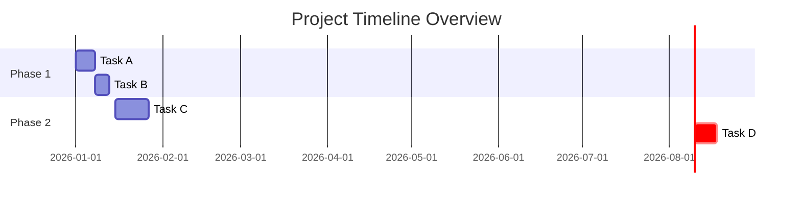

# Status Report Generator Skill

## Overview

**Skill Name:** `status_report_generator`
**Domain:** `silver`
**Purpose:** Generate automated, clear, and concise status reports in Markdown format for tasks, approvals, and project milestones, ensuring timely communication and accurate progress tracking.

**Core Capabilities:**
- Generate structured Markdown status reports from various data sources.
- Summarize task progress, blockers, and upcoming activities.
- Report on the status of approval requests and their lifecycle.
- Track project milestones, their completion status, and any deviations.
- Highlight critical issues, risks, and dependencies.
- Ensure accurate aggregation of data and inclusion of relevant timestamps.
- Handle missing updates or incomplete data gracefully.
- Support customizable report layouts and content sections.

**When to Use:**
- Weekly, bi-weekly, or monthly project status updates.
- Executive reporting on project health and progress.
- Stakeholder communications regarding key milestones and approvals.
- Daily stand-up or team sync reports.
- Automated generation for recurring reporting cycles.
- Documenting project history and progress over time.

**When NOT to Use:**
- Real-time interactive dashboards (use dedicated BI tools).
- Ad-hoc data analysis requiring deep drill-down capabilities.
- Storing raw, sensitive data directly in Markdown reports (reports should be summaries).
- Extremely detailed technical documentation (use dedicated documentation tools).
- For highly dynamic data that changes minute-to-minute (reports are snapshots).

---

## Impact Analysis

### Communication Impact: **CRITICAL**
-   **Accuracy Risk:** Inaccurate or outdated information misleads stakeholders and causes incorrect decisions.
-   **Clarity:** Vague or poorly organized reports lead to misunderstanding and rework.
-   **Completeness:** Missing critical updates (tasks, approvals, milestones) can result in missed deadlines or ignored risks.
-   **Timeliness:** Delayed reports make information irrelevant and reduce proactive decision-making.

### Business Impact: **HIGH**
-   **Decision Making:** Accurate and timely reports enable informed business and strategic decisions.
-   **Transparency:** Clear reporting fosters trust and alignment among project teams and stakeholders.
-   **Efficiency:** Automated generation saves significant manual effort, allowing teams to focus on core tasks.
-   **Risk Management:** Early identification and reporting of issues and risks help in timely mitigation.
-   **Accountability:** Provides a clear record of progress and accountability for deliverables.

### System Impact: **MEDIUM**
-   **Data Source Integration:** Requires robust and reliable connections to various project management, approval, and metric systems.
-   **Performance:** Report generation must be efficient, especially for large projects or frequent reporting.
-   **Template Maintenance:** Templates need to be flexible, easy to update, and maintain consistency across reports.
-   **Security:** Data extracted for reports must adhere to access controls and privacy policies; reports themselves should not expose sensitive raw data.

---

## Environment Variables

### Required Variables

```bash
# Report generation configuration
STATUS_REPORT_TEMPLATE_PATH="./templates/reports" # Template directory
STATUS_REPORT_OUTPUT_PATH="./reports"             # Output directory
STATUS_REPORT_DATA_SOURCE="json"                  # Data source type (e.g., json, yaml, api)

# Content preferences
STATUS_REPORT_DATE_FORMAT="%Y-%m-%d %H:%M:%S"     # Date format for reports
STATUS_REPORT_TIMEZONE="UTC"                      # Timezone for date/time sensitive data
```

### Optional Variables

```bash
# Advanced options
STATUS_REPORT_INCLUDE_TOC="true"                  # Generate table of contents
STATUS_REPORT_TOC_DEPTH="3"                       # TOC depth (1-6)
STATUS_REPORT_INCLUDE_MERMAID="true"              # Include Mermaid diagrams (e.g., for project timelines)

# Data fetching
STATUS_REPORT_API_ENDPOINT=""                     # API endpoint for fetching data
STATUS_REPORT_API_TOKEN=""                        # API token for authentication
STATUS_REPORT_FALLBACK_DATA_PATH="./fallback_data.json" # Local fallback data if API fails

# Styling and branding
STATUS_REPORT_LOGO_URL=""                         # URL to company logo in report header
STATUS_REPORT_THEME="default"                     # 'default', 'light', 'dark' (influences Mermaid)

# Validation and quality
STATUS_REPORT_MIN_SECTIONS="4"                    # Minimum sections required for a report
STATUS_REPORT_REQUIRE_MILESTONES="true"           # Require at least one milestone section
STATUS_REPORT_FAIL_ON_MISSING_DATA="true"         # If true, fail if required data is missing
STATUS_REPORT_WARN_ON_STALE_DATA="true"           # If true, add warning if data is older than X hours
STATUS_REPORT_STALE_DATA_THRESHOLD_HOURS="24"     # Threshold for stale data warning
```

---

## Network and Authentication Implications

### Local Generation Mode

**Primary Mode:** File-based data and template processing.

**Requirements:**
- Read access to local data files (JSON, YAML).
- Read access to template directory.
- Write access to output directory.
- No network dependencies (fully offline capable).

### Integrated Mode (Optional)

**For external data source integration (e.g., Jira, GitHub, internal APIs):**

```bash
# API Authentication
STATUS_REPORT_API_AUTH_TYPE="bearer"             # e.g., bearer, basic, api_key
STATUS_REPORT_API_USERNAME=""                    # For basic auth
STATUS_REPORT_API_PASSWORD=""                    # For basic auth

# External data sources
STATUS_REPORT_TASKS_API="https://jira.example.com/api"
STATUS_REPORT_APPROVALS_API="https://approvals.example.com/api"
STATUS_REPORT_MILESTONES_API="https://roadmap.example.com/api"
```

**Authentication Patterns:**
- **Bearer Token:** For modern REST APIs (recommended).
- **Basic Auth:** For legacy systems or internal tools.
- **API Key:** For simple service-to-service communication.
- **OAuth 2.0:** For complex delegated access (if external API supports).

### Network Patterns

**Pattern 1: Standalone (No Network)**
```bash
# Generates reports solely from local data files.
# Ideal for disconnected environments or pre-processed data.
```

**Pattern 2: Hybrid (Optional Network)**
```bash
# Fetches data from APIs, but uses local fallback data if network issues occur.
# Provides resilience and partial reporting capabilities.
```

**Pattern 3: Fully Integrated (Network Required)**
```bash
# Reliant on network connectivity to fetch real-time or near real-time data from external systems.
# Essential for up-to-the-minute reporting.
```

---

## Blueprints & Templates

### Template 1: Standard Project Status Report

**File:** `assets/report-template.md`

```markdown
---
title: {{REPORT_TITLE}}
date: {{REPORT_DATE}}
author: {{AUTHOR}}
project: {{PROJECT_NAME}}
version: 1.0.0
status: generated
---

# {{REPORT_TITLE}}
### For Project: {{PROJECT_NAME}}

## Executive Summary

{{EXECUTIVE_SUMMARY}}

{{STALE_DATA_WARNING}}

---

## Table of Contents

<!-- AUTO-GENERATED TOC -->

---

## 1. Overall Project Status

| Item        | Status    | RAG (Red/Amber/Green) | Comments / Trend |
|-------------|-----------|-----------------------|------------------|
| Scope       | {{SCOPE_STATUS}}      | {{SCOPE_RAG}}         | {{SCOPE_COMMENTS}}       |
| Schedule    | {{SCHEDULE_STATUS}}   | {{SCHEDULE_RAG}}      | {{SCHEDULE_COMMENTS}}    |
| Budget      | {{BUDGET_STATUS}}     | {{BUDGET_RAG}}        | {{BUDGET_COMMENTS}}      |
| Resources   | {{RESOURCES_STATUS}}  | {{RESOURCES_RAG}}     | {{RESOURCES_COMMENTS}}   |
| Quality     | {{QUALITY_STATUS}}    | {{QUALITY_RAG}}       | {{QUALITY_COMMENTS}}     |

### Key Highlights
- {{HIGHLIGHT_1}}
- {{HIGHLIGHT_2}}

### Key Lowlights
- {{LOWLIGHT_1}}
- {{LOWLIGHT_2}}

---

## 2. Recent Progress & Activities (Last Reporting Period)

- **{{ACTIVITY_DATE_1}}**: {{ACTIVITY_DESCRIPTION_1}}
- **{{ACTIVITY_DATE_2}}**: {{ACTIVITY_DESCRIPTION_2}}
- **{{ACTIVITY_DATE_3}}**: {{ACTIVITY_DESCRIPTION_3}}
{{OTHER_RECENT_ACTIVITIES}}

---

## 3. Upcoming Activities (Next Reporting Period)

- **{{UPCOMING_DATE_1}}**: {{UPCOMING_DESCRIPTION_1}}
- **{{UPCOMING_DATE_2}}**: {{UPCOMING_DESCRIPTION_2}}
- **{{UPCOMING_DATE_3}}**: {{UPCOMING_DESCRIPTION_3}}
{{OTHER_UPCOMING_ACTIVITIES}}

---

## 4. Task Status Update

### Open Tasks by Priority

| Priority | Count | Due This Week | Blocked Tasks | Owners   |
|----------|-------|---------------|---------------|----------|
| High     | {{HIGH_TASK_COUNT}} | {{HIGH_TASK_THIS_WEEK}} | {{HIGH_TASK_BLOCKED}} | {{HIGH_TASK_OWNERS}} |
| Medium   | {{MEDIUM_TASK_COUNT}} | {{MEDIUM_TASK_THIS_WEEK}} | {{MEDIUM_TASK_BLOCKED}} | {{MEDIUM_TASK_OWNERS}} |
| Low      | {{LOW_TASK_COUNT}} | {{LOW_TASK_THIS_WEEK}} | {{LOW_TASK_BLOCKED}} | {{LOW_TASK_OWNERS}} |

### Critical Blockers & Dependencies
- **Task ID: {{BLOCKER_TASK_ID_1}}**: {{BLOCKER_DESCRIPTION_1}} (Dependency: {{BLOCKER_DEPENDENCY_1}})
- **Task ID: {{BLOCKER_TASK_ID_2}}**: {{BLOCKER_DESCRIPTION_2}} (Dependency: {{BLOCKER_DEPENDENCY_2}})
{{OTHER_BLOCKERS}}

---

## 5. Approvals Status

### Pending Critical Approvals

| Request ID | Type         | Initiator   | Current Approver | Status    | Due Date   |
|------------|--------------|-------------|------------------|-----------|------------|
| {{APPROVE_ID_1}} | {{APPROVE_TYPE_1}} | {{APPROVE_INIT_1}} | {{APPROVE_APPROVER_1}} | {{APPROVE_STATUS_1}} | {{APPROVE_DUEDATE_1}} |
| {{APPROVE_ID_2}} | {{APPROVE_TYPE_2}} | {{APPROVE_INIT_2}} | {{APPROVE_APPROVER_2}} | {{APPROVE_STATUS_2}} | {{APPROVE_DUEDATE_2}} |
{{OTHER_PENDING_APPROVALS}}

---

## 6. Project Milestones

### Upcoming Milestones

| Milestone Name | Target Date | Status      | Comments                                 |
|----------------|-------------|-------------|------------------------------------------|
| {{MILESTONE_NAME_1}} | {{MILESTONE_DATE_1}} | {{MILESTONE_STATUS_1}} | {{MILESTONE_COMMENTS_1}} |
| {{MILESTONE_NAME_2}} | {{MILESTONE_DATE_2}} | {{MILESTONE_STATUS_2}} | {{MILESTONE_COMMENTS_2}} |
{{OTHER_UPCOMING_MILESTONES}}

### Recently Achieved Milestones

- **{{ACHIEVED_MILESTONE_1}}** (Achieved: {{ACHIEVED_DATE_1}}) - {{ACHIEVED_COMMENTS_1}}
- **{{ACHIEVED_MILESTONE_2}}** (Achieved: {{ACHIEVED_DATE_2}}) - {{ACHIEVED_COMMENTS_2}}
{{OTHER_ACHIEVED_MILESTONES}}



---

## 7. Risks & Issues

### Top Risks

| Risk ID | Description                                     | Impact   | Probability | Mitigation Plan                    | Status   |
|---------|-------------------------------------------------|----------|-------------|------------------------------------|----------|
| {{RISK_ID_1}} | {{RISK_DESCRIPTION_1}} | {{RISK_IMPACT_1}} | {{RISK_PROBABILITY_1}} | {{RISK_MITIGATION_1}} | {{RISK_STATUS_1}} |
| {{RISK_ID_2}} | {{RISK_DESCRIPTION_2}} | {{RISK_IMPACT_2}} | {{RISK_PROBABILITY_2}} | {{RISK_MITIGATION_2}} | {{RISK_STATUS_2}} |
{{OTHER_RISKS}}

### Open Issues

- **Issue {{ISSUE_ID_1}}**: {{ISSUE_DESCRIPTION_1}} (Owner: {{ISSUE_OWNER_1}}, Due: {{ISSUE_DUE_1}})
- **Issue {{ISSUE_ID_2}}**: {{ISSUE_DESCRIPTION_2}} (Owner: {{ISSUE_OWNER_2}}, Due: {{ISSUE_DUE_2}})
{{OTHER_ISSUES}}

---

## Action Items for Next Period

- **Action 1:** {{ACTION_ITEM_1}}
- **Action 2:** {{ACTION_ITEM_2}}
- **Action 3:** {{ACTION_ITEM_3}}
{{OTHER_ACTION_ITEMS}}

---

## Appendices

### Contact Information
- **Project Manager:** {{PM_NAME}} ({{PM_EMAIL}})
- **Technical Lead:** {{TL_NAME}} ({{TL_EMAIL}})
{{OTHER_CONTACTS}}

---

## Report Details

**Generated By:** Status Report Generator Skill
**Source Data Last Updated:** {{DATA_LAST_UPDATED}}
**Report Generation Time:** {{REPORT_GENERATION_TIME}}
