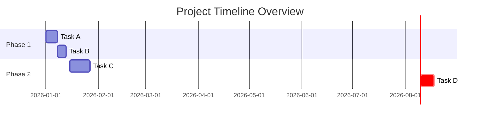

# {{REPORT_TITLE}}
### For Project: {{PROJECT_NAME}}

## Executive Summary

{{EXECUTIVE_SUMMARY}}

{{STALE_DATA_WARNING}}

---

## Table of Contents

<!-- AUTO-GENERATED TOC -->

---

## 1. Overall Project Status

| Item        | Status    | RAG (Red/Amber/Green) | Comments / Trend |
|-------------|-----------|-----------------------|------------------|
| Scope       | {{SCOPE_STATUS}}      | {{SCOPE_RAG}}         | {{SCOPE_COMMENTS}}       |
| Schedule    | {{SCHEDULE_STATUS}}   | {{SCHEDULE_RAG}}      | {{SCHEDULE_COMMENTS}}    |
| Budget      | {{BUDGET_STATUS}}     | {{BUDGET_RAG}}        | {{BUDGET_COMMENTS}}      |
| Resources   | {{RESOURCES_STATUS}}  | {{RESOURCES_RAG}}     | {{RESOURCES_COMMENTS}}   |
| Quality     | {{QUALITY_STATUS}}    | {{QUALITY_RAG}}       | {{QUALITY_COMMENTS}}     |

### Key Highlights
- {{HIGHLIGHT_1}}
- {{HIGHLIGHT_2}}

### Key Lowlights
- {{LOWLIGHT_1}}
- {{LOWLIGHT_2}}

---

## 2. Recent Progress & Activities (Last Reporting Period)

- **{{ACTIVITY_DATE_1}}**: {{ACTIVITY_DESCRIPTION_1}}
- **{{ACTIVITY_DATE_2}}**: {{ACTIVITY_DESCRIPTION_2}}
- **{{ACTIVITY_DATE_3}}**: {{ACTIVITY_DESCRIPTION_3}}
{{OTHER_RECENT_ACTIVITIES}}

---

## 3. Upcoming Activities (Next Reporting Period)

- **{{UPCOMING_DATE_1}}**: {{UPCOMING_DESCRIPTION_1}}
- **{{UPCOMING_DATE_2}}**: {{UPCOMING_DESCRIPTION_2}}
- **{{UPCOMING_DATE_3}}**: {{UPCOMING_DESCRIPTION_3}}
{{OTHER_UPCOMING_ACTIVITIES}}

---

## 4. Task Status Update

### Open Tasks by Priority

| Priority | Count | Due This Week | Blocked Tasks | Owners   |
|----------|-------|---------------|---------------|----------|
| High     | {{HIGH_TASK_COUNT}} | {{HIGH_TASK_THIS_WEEK}} | {{HIGH_TASK_BLOCKED}} | {{HIGH_TASK_OWNERS}} |
| Medium   | {{MEDIUM_TASK_COUNT}} | {{MEDIUM_TASK_THIS_WEEK}} | {{MEDIUM_TASK_BLOCKED}} | {{MEDIUM_TASK_OWNERS}} |
| Low      | {{LOW_TASK_COUNT}} | {{LOW_TASK_THIS_WEEK}} | {{LOW_TASK_BLOCKED}} | {{LOW_TASK_OWNERS}} |

### Critical Blockers & Dependencies
- **Task ID: {{BLOCKER_TASK_ID_1}}**: {{BLOCKER_DESCRIPTION_1}} (Dependency: {{BLOCKER_DEPENDENCY_1}})
- **Task ID: {{BLOCKER_TASK_ID_2}}**: {{BLOCKER_DESCRIPTION_2}} (Dependency: {{BLOCKER_DEPENDENCY_2}})
{{OTHER_BLOCKERS}}

---

## 5. Approvals Status

### Pending Critical Approvals

| Request ID | Type         | Initiator   | Current Approver | Status    | Due Date   |
|------------|--------------|-------------|------------------|-----------|------------|
| {{APPROVE_ID_1}} | {{APPROVE_TYPE_1}} | {{APPROVE_INIT_1}} | {{APPROVE_APPROVER_1}} | {{APPROVE_STATUS_1}} | {{APPROVE_DUEDATE_1}} |
| {{APPROVE_ID_2}} | {{APPROVE_TYPE_2}} | {{APPROVE_INIT_2}} | {{APPROVE_APPROVER_2}} | {{APPROVE_STATUS_2}} | {{APPROVE_DUEDATE_2}} |
{{OTHER_PENDING_APPROVALS}}

---

## 6. Project Milestones

### Upcoming Milestones

| Milestone Name | Target Date | Status      | Comments                                 |
|----------------|-------------|-------------|------------------------------------------|
| {{MILESTONE_NAME_1}} | {{MILESTONE_DATE_1}} | {{MILESTONE_STATUS_1}} | {{MILESTONE_COMMENTS_1}} |
| {{MILESTONE_NAME_2}} | {{MILESTONE_DATE_2}} | {{MILESTONE_STATUS_2}} | {{MILESTONE_COMMENTS_2}} |
{{OTHER_UPCOMING_MILESTONES}}

### Recently Achieved Milestones

- **{{ACHIEVED_MILESTONE_1}}** (Achieved: {{ACHIEVED_DATE_1}}) - {{ACHIEVED_COMMENTS_1}}
- **{{ACHIEVED_MILESTONE_2}}** (Achieved: {{ACHIEVED_DATE_2}}) - {{ACHIEVED_COMMENTS_2}}
{{OTHER_ACHIEVED_MILESTONES}}

---

## 7. Risks & Issues

### Top Risks

| Risk ID | Description                                     | Impact   | Probability | Mitigation Plan                    | Status   |
|---------|-------------------------------------------------|----------|-------------|------------------------------------|----------|
| {{RISK_ID_1}} | {{RISK_DESCRIPTION_1}} | {{RISK_IMPACT_1}} | {{RISK_PROBABILITY_1}} | {{RISK_MITIGATION_1}} | {{RISK_STATUS_1}} |
| {{RISK_ID_2}} | {{RISK_DESCRIPTION_2}} | {{RISK_IMPACT_2}} | {{RISK_PROBABILITY_2}} | {{RISK_MITIGATION_2}} | {{RISK_STATUS_2}} |
{{OTHER_RISKS}}

### Open Issues

- **Issue {{ISSUE_ID_1}}**: {{ISSUE_DESCRIPTION_1}} (Owner: {{ISSUE_OWNER_1}}, Due: {{ISSUE_DUE_1}})
- **Issue {{ISSUE_ID_2}}**: {{ISSUE_DESCRIPTION_2}} (Owner: {{ISSUE_OWNER_2}}, Due: {{ISSUE_DUE_2}})
{{OTHER_ISSUES}}

---

## Action Items for Next Period

- **Action 1:** {{ACTION_ITEM_1}}
- **Action 2:** {{ACTION_ITEM_2}}
- **Action 3:** {{ACTION_ITEM_3}}
{{OTHER_ACTION_ITEMS}}

---

## Appendices

### Contact Information
- **Project Manager:** {{PM_NAME}} ({{PM_EMAIL}})
- **Technical Lead:** {{TL_NAME}} ({{TL_EMAIL}})
{{OTHER_CONTACTS}}

---

## Report Details

**Generated By:** Status Report Generator Skill
**Source Data Last Updated:** {{DATA_LAST_UPDATED}}
**Report Generation Time:** {{REPORT_GENERATION_TIME}}
