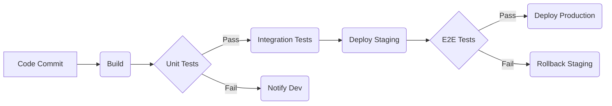

# Status Report Generator - Common Patterns

## Overview
This document describes common patterns, strategies, and best practices for generating effective Markdown-based status reports.

---

## Pattern 1: Executive Summary Focused Report

### Use Case
For high-level stakeholders (e.g., senior management, clients) who need a quick, concise overview of project health, key highlights, and critical issues without deep technical details.

### Strategy
1.  **Prioritize Executive Summary:** The most crucial information should be in the first section.
2.  **RAG Status:** Use Red/Amber/Green (RAG) indicators for overall project aspects (scope, schedule, budget, resources, quality).
3.  **Key Highlights & Lowlights:** Summarize major achievements and significant challenges or risks.
4.  **Actionable Insights:** Include a short list of key action items or decisions required from leadership.
5.  **Conciseness:** Keep all sections brief and to the point; avoid jargon.

### Example Structure
```markdown
# Project Nebula - Weekly Executive Status

## Executive Summary
Project Nebula is Green overall. Design phase is 80% complete, ahead of schedule. We've encountered a minor technical debt issue in module X (Amber), which is being addressed without impacting critical path. Requires leadership decision on Q2 budget allocation for new feature exploration.

## 1. Overall Project Status
| Item     | Status    | RAG   | Comments / Trend                |
|----------|-----------|-------|---------------------------------|
| Scope    | Stable    | Green | No changes                      |
| Schedule | Ahead     | Green | +5 days                         |
| Budget   | On Track  | Green | Within allocated budget         |
| Quality  | High      | Green | No critical bugs                |

## 2. Key Highlights
- Completed design for core API services.
- Integrated CI/CD pipeline for backend.

## 3. Key Lowlights
- Technical debt identified in legacy authentication module.

## Action Items
- Approve Q2 budget for new feature prototype by EOD.
```

---

## Pattern 2: Detailed Project Progress Report

### Use Case
For project teams, functional leads, and mid-level management who need a more granular view of tasks, approvals, milestones, and dependencies.

### Strategy
1.  **Structured Sections:** Organize the report into distinct sections for Recent Activities, Upcoming Activities, Task Status, Approvals, and Milestones.
2.  **Quantifiable Data:** Provide metrics where possible (e.g., task counts, completion percentages).
3.  **Dependency Tracking:** Clearly identify blockers and dependencies, including owners and due dates.
4.  **Milestone Tracking:** Detail progress against key project milestones (upcoming and recently achieved).
5.  **Risks & Issues:** Include a dedicated section for current risks and open issues with their mitigation plans.

### Example Structure
```markdown
# Project Andromeda - Bi-Weekly Status Report

## Executive Summary
Project Andromeda is currently in the development phase. All critical path tasks are on track, with minor delays in non-critical components. High priority tasks are being addressed.

## 1. Recent Progress & Activities
- **2026-02-03:** Completed database schema design review.
- **2026-02-05:** Deployed initial backend services to staging.

## 2. Upcoming Activities
- **2026-02-12:** Begin frontend integration testing.
- **2026-02-19:** Target completion for core API development.

## 3. Task Status Update
### Open Tasks by Priority
| Priority | Count | Due This Week | Blocked Tasks | Owners      |
|----------|-------|---------------|---------------|-------------|
| High     | 4     | 2             | 1             | Dev Team    |
| Medium   | 8     | 3             | 0             | Dev Team    |

### Critical Blockers & Dependencies
- **TASK-123:** Awaiting 3rd party API access (Dependency: Vendor X, Due: 2026-02-10)

## 4. Project Milestones
### Upcoming Milestones
| Milestone Name      | Target Date | Status    | Comments       |
|---------------------|-------------|-----------|----------------|
| API Freeze          | 2026-02-28  | On Track  | All endpoints defined |

### Recently Achieved Milestones
- **Design Complete** (Achieved: 2026-02-01) - Ahead of schedule.

## 5. Risks & Issues
### Top Risks
| Risk ID | Description                        | Impact | Mitigation                  | Status |
|---------|------------------------------------|--------|-----------------------------|--------|
| R-001   | Vendor API delays                  | High   | Frequent check-ins, fallback | Amber  |

### Open Issues
- **ISSUE-005:** Staging environment instability (Owner: DevOps, Due: 2026-02-09)
```

---

## Pattern 3: Automated "What Changed" Report

### Use Case
For internal team use, often generated daily, to provide a concise list of changes, completed tasks, and resolved issues since the last report. Focuses on deltas rather than the full state.

### Strategy
1.  **Compare Data Snapshots:** Requires access to previous report's data or a system that tracks changes.
2.  **Focus on Deltas:** Only report new, completed, or significantly changed items (e.g., status changes, new blockers, resolved risks).
3.  **Timestamp:** Clearly indicate the reporting period (e.g., "Changes from Yesterday").
4.  **Concise Lists:** Use bullet points for easy scanning.

### Example Structure
```markdown
# Daily Project Echo - Change Log

## Changes Since Last Report (2026-02-05)

## 1. Completed Tasks
- **TASK-456:** Implemented user login flow.
- **TASK-457:** Fixed minor UI bug on dashboard.

## 2. New Tasks
- **TASK-458:** Investigate performance regression in search. (High Priority)

## 3. Status Changes
- **TASK-450:** "In Review" -> "Completed"
- **TASK-455:** "Pending" -> "Blocked" (New Blocker: External API)

## 4. New Approvals
- **APP-008:** Data Privacy Impact Assessment (Pending Legal Review)

## 5. New Risks
- **RISK-005:** Search performance degradation during peak hours.
```

---

## Pattern 4: Technical Health Report (with Mermaid)

### Use Case
For engineering teams and technical leads to monitor specific technical aspects, progress on engineering tasks, and visualize dependencies or architecture.

### Strategy
1.  **Technical Focus:** Include metrics relevant to engineering (e.g., code quality, test coverage, build times).
2.  **Mermaid Diagrams:** Utilize Mermaid for sequence diagrams, Gantt charts for timelines, or flowcharts for processes.
3.  **Detailed Task Breakdown:** Link to relevant JIRA tickets or GitHub issues.
4.  **Integration with CI/CD:** Report on build status and deployment metrics.

### Example Structure
```markdown
# Project Nova - Weekly Engineering Health

## Executive Summary
Backend API development is on track. Frontend team is integrating new components. CI/CD pipelines are stable.

## 1. Key Engineering Metrics
| Metric          | Value | Trend | Status |
|-----------------|-------|-------|--------|
| Test Coverage   | 85%   | ↑     | Green  |
| Build Success   | 98%   | Stable| Green  |
| Code Smells (Backend) | 120   | ↓     | Green  |

## 2. CI/CD Pipeline Status


## 3. Active Development Tasks
- **FEAT-100:** Implement User Profile Service (Assigned: Alice, Status: In Progress, Due: 2026-02-15)
- **BUG-005:** Fix authentication token refresh (Assigned: Bob, Status: In Review, Priority: High)

## 4. Upcoming Deployments
- **Deploy Frontend v1.0:** Target 2026-02-10 (After API Freeze)
```

---

## Best Practices for Status Report Generation

1.  **Audience-Centric:** Tailor content and detail level to the target audience.
2.  **Consistency:** Use a consistent template, terminology, and RAG definitions across all reports.
3.  **Data Source Reliability:** Ensure the data feeding the report is accurate and from authoritative sources.
4.  **Automation:** Automate data extraction and report generation as much as possible to reduce manual errors and ensure timeliness.
5.  **Clarity & Brevity:** Get straight to the point. Use bullet points, clear headings, and avoid unnecessary prose.
6.  **Actionable Information:** Clearly state any decisions needed, blockers, or upcoming critical activities.
7.  **Version Control:** Keep report templates and generated reports (if historical) under version control.
8.  **Feedback Loop:** Continuously gather feedback from report recipients to refine content and format.
9.  **Stale Data Warning:** Implement mechanisms to warn if the underlying data is old or potentially inaccurate.

---

**Last Updated:** 2026-02-06
